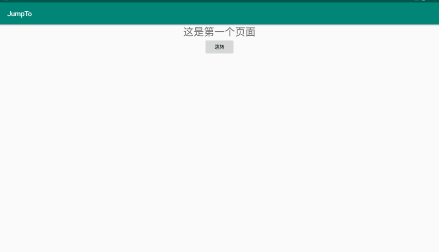
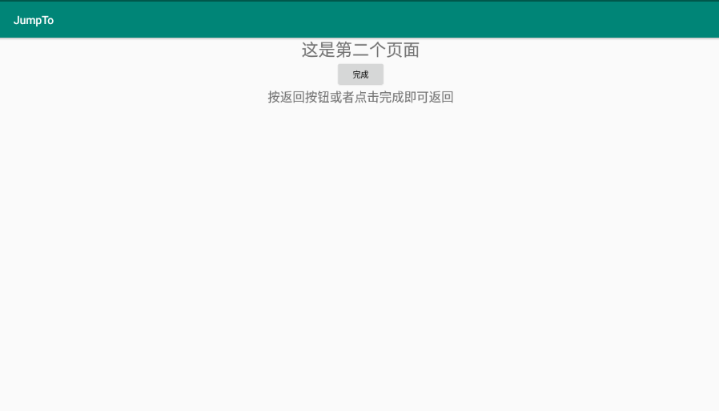
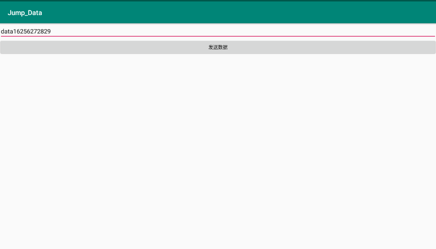

# Activity跳转和传递数据

## 一、跳转页面

### 1.新建另一个空Activity


### 2.添加布局

第一个Activity

```xml
<?xml version="1.0" encoding="utf-8"?>
<LinearLayout xmlns:android="http://schemas.android.com/apk/res/android"
    android:layout_width="match_parent"
    android:layout_height="match_parent"
    android:orientation="vertical">
    <TextView
        android:layout_width="wrap_content"
        android:layout_height="wrap_content"
        android:text="这是第一个页面"
        android:layout_gravity="center"
        android:textSize="30sp"/>

    <Button
        android:id="@+id/btn_jump"
        android:layout_width="wrap_content"
        android:layout_height="wrap_content"
        android:layout_gravity="center"
        android:text="跳转"/>

</LinearLayout>
```



第二个Activity

```xml
<?xml version="1.0" encoding="utf-8"?>
<LinearLayout xmlns:android="http://schemas.android.com/apk/res/android"
    android:layout_width="match_parent"
    android:layout_height="match_parent"
    android:orientation="vertical">
    <TextView
        android:layout_width="wrap_content"
        android:layout_height="wrap_content"
        android:text="这是第二个页面"
        android:layout_gravity="center"
        android:textSize="30sp"/>

    <Button
        android:id="@+id/btn_finish"
        android:layout_width="wrap_content"
        android:layout_height="wrap_content"
        android:layout_gravity="center"
        android:text="完成"/>

    <TextView
        android:layout_width="wrap_content"
        android:layout_height="wrap_content"
        android:text="按返回按钮或者点击完成即可返回"
        android:layout_gravity="center"
        android:textSize="22sp"/>

</LinearLayout>
```



### 3.在第一个Activity中对按钮设置监听

```java
findViewById(R.id.btn_jump).setOnClickListener(this);
```

### 4.调用startActivity()方法，启动第二个界面

```java
@Override
public void onClick(View view) {

    startActivity(new Intent(this,Main2Activity.class));
}
```

调用startActivity()方法需要一个Intent意图，而new Intent(this,Main2Activity.class)

第一个参数是上下文对象this也可以写类名.this，第二个参数是目标类

```java
public Intent(Context packageContext, Class<?> cls)
```

### 5.在第二个页面添加按钮监听器

点击时调用finish()或者System.exit()方法结束Activity

## 二、显示Intent和隐式Intent

### 1．显式Intent

1．显式Intent，直接指定来源活动与目标活动，属于精确匹配 在构建一个意图对象时，需要指定两个参数，第一个参数表示跳转的来源页面，即“来源Activity.this”； 第二个参数表示待跳转的页面，即“目标Activity.class”。具体的意图构建方式有如下3种：

####  （1）在Intent的构造函数中指定，示例代码如下：

```java
Intent intent = new Intent(this, ActNextActivity.class);  // 创建一个目标确定的意图
```

#### （2）调用意图对象的setClass方法指定，示例代码如下：

```java
Intent intent = new Intent();  // 创建一个新意图 
intent.setClass(this, ActNextActivity.class); // 设置意图要跳转的目标活动
```

#### （3）调用意图对象的setComponent方法指定，示例代码如下：

```java
Intent intent = new Intent();  // 创建一个新意图 
ComponentName component = new ComponentName(this, ActNextActivity.class); // 创建包含目标活动在内的组件名称对象 
intent.setComponent(component);  // 设置意图携带的组件信息
```

### 2．隐式Intent

2．隐式Intent，没有明确指定要跳转的目标活动，只给出一个动作字符串让系统自动匹配，属于模糊 匹配
通常App不希望向外部暴露活动名称，只给出一个事先定义好的标记串，这样大家约定俗成、按图索骥 就好，隐式Intent便起到了标记过滤作用。这个动作名称标记串，可以是自己定义的动作，也可以是已 有的系统动作。常见系统动作的取值说明见表4-4。

| Intent 类的系统动作常量名 | 系统动作的常量值             | 说明            |
| ------------------------- | ---------------------------- | --------------- |
| ACTION_MAIN               | android.intent.action.MAIN   | App启动时的入口 |
| ACTION_VIEW               | android.intent.action.VIEW   | 向用户显示数据  |
| ACTION_SEND               | android.intent.action.SEND   | 分享内容        |
| ACTION_CALL               | android.intent.action.CALL   | 直接拨号        |
| ACITON_DIAL               | android.intent.action.DIAL   | 准备拨号        |
| ACTION_SENDTO             | android.intent.action.SENDTO | 发送短信        |
| ACTION_ANSWER             | android.intent.action.ANSWER | 接听电话        |

 动作名称既可以通过setAction方法指定，也可以通过构造函数Intent(String action)直接生成意图对象。 当然，由于动作是模糊匹配，因此有时需要更详细的路径，比如仅知道某人住在天通苑小区，并不能直 接找到他家，还得说明他住在天通苑的哪一期、哪栋楼、哪一层、哪一个单元。Uri和Category便是这样 的路径与门类信息，Uri数据可通过构造函数Intent(String action, Uri uri)在生成对象时一起指定，也可 通过setData方法指定（setData这个名字有歧义，实际相当于setUri）；Category可通过addCategory 方法指定，之所以用add而不用set方法，是因为一个意图允许设置多个Category，方便一起过滤。 下面是一个调用系统拨号程序的代码例子，其中就用到了Uri： 

```java
String phoneNo = "12345"; 
Intent intent = new Intent();  // 创建一个新意图 
intent.setAction(Intent.ACTION_DIAL);  // 设置意图动作为准备拨号 
Uri uri = Uri.parse("tel:" + phoneNo);  // 声明一个拨号的Uri 
intent.setData(uri);  // 设置意图前往的路径 
startActivity(intent);  // 启动意图通往的活动页面
```

## 三、向下一个Activity发送数据

Intent重载了很多种putExtra方法传递各种类型的参数，包括整型、双 精度型、字符串等基本数据类型，甚至Serializable这样的序列化结构。

只是调用putExtra方法显然不好 管理，像送快递一样大小包裹随便扔，不但找起来不方便，丢了也难以知道。

所以Android引入了 Bundle概念，可以把Bundle理解为超市的寄包柜或快递收件柜，大小包裹由Bundle统一存取，方便又 安全。

Bundle内部用于存放消息的数据结构是Map映射，既可添加或删除元素，还可判断元素是否存在。

开发 者若要把Bundle数据全部打包好，只需调用一次意图对象的putExtras方法；若要把Bundle数据全部取 出来，也只需调用一次意图对象的getExtras方法。

| 数据类型     | 读方法             | 写方法             |
| ------------ | ------------------ | ------------------ |
| 整型数       | getInt             | putInt             |
| 浮点数       | getFloat           | putFloat           |
| 双精度数     | getDouble          | putDouble          |
| 布尔值       | getBoolean         | putBoolean         |
| 字符串       | getString          | putString          |
| 字符串数组   | getStringArray     | putStringArray     |
| 字符串列表   | getStringArrayList | putStringArrayList |
| 可序列化结构 | getSerializable    | putSerializable    |


```java
// 创建一个意图对象，准备跳到指定的活动页面 
Intent intent = new Intent(this, ActReceiveActivity.class); 
Bundle bundle = new Bundle();  // 创建一个新包裹 
// 往包裹存入名为request_time的字符串 
bundle.putString("request_time", DateUtil.getNowTime()); 
// 往包裹存入名为request_content的字符串 
bundle.putString("request_content", tv_send.getText().toString()); 
intent.putExtras(bundle);// 把快递包裹塞给意图 
startActivity(intent); // 跳转到意图指定的活动页面
```

然后在下一个活动中获取意图携带的快递包裹，从包裹取出各参数信息，并将传来的数据显示到文本视 图。下面便是目标活动获取并展示包裹数据的代码例子： 

```java
// 从布局文件中获取名为tv_receive的文本视图 
TextView tv_receive = findViewById(R.id.tv_receive); // 从上一个页面传来的意图中获取快递包裹 
Bundle bundle = getIntent().getExtras(); // 从包裹中取出名为request_time的字符串 
String request_time = bundle.getString("request_time"); // 从包裹中取出名为request_content的字符串 
String request_content = bundle.getString("request_content"); 
String desc = String.format("收到请求消息：\n请求时间为%s\n请求内容为%s",                            
                request_time, request_content); tv_receive.setText(desc);  // 把请求消息的详情显示在文本视图上
```




## 四、向上一个Activity返回数据

处理下一个页面的应答数据，详细步骤说明如下：

> 1.上一个页面打包好请求数据，调用startActivityForResult方法执行跳转动作
>
> 2.下一个页面接收并解析请求数据，进行相应处理
>
> 3.下一个页面在返回上一个页面时，打包应答数据并调用setResult方法返回数据包裹
>
> 4.上一个页面重写方法onActivityResult，解析获得下一个页面的返回数据


### 步骤一，上一个页面打包好请求数据，调用startActivityForResult方法执行跳转动作，表示需要处理下 一个页面的应答数据，该方法的第二个参数表示请求代码，它用于标识每个跳转的唯一性。跳转代码示 例如下： 

```java
String request = "你吃饭了吗？来我家吃吧"; // 创建一个意图对象，准备跳到指定的活动页面 
Intent intent = new Intent(this, ActResponseActivity.class); 
Bundle bundle = new Bundle();  // 创建一个新包裹 // 往包裹存入名为request_time的字符串 
bundle.putString("request_time", DateUtil.getNowTime()); // 往包裹存入名为request_content的字符串 
bundle.putString("request_content", request); intent.putExtras(bundle);  // 把快递包裹塞给意图 
// 期望接收下个页面的返回数据。第二个参数为本次请求代码 
startActivityForResult(intent, 0);
```

### 步骤二，下一个页面接收并解析请求数据，进行相应处理。接收代码示例如下：

```java
// 从上一个页面传来的意图中获取快递包裹 
Bundle bundle = getIntent().getExtras(); // 从包裹中取出名为request_time的字符串 
String request_time = bundle.getString("request_time"); // 从包裹中取出名为request_content的字符串 
String request_content = bundle.getString("request_content"); 
String desc = String.format("收到请求消息：\n请求时间为%s\n请求内容为%s",request_time, request_content); tv_request.setText(desc); 
// 把请求消息的详情显示在文本视图上
```

### 步骤三，下一个页面在返回上一个页面时，打包应答数据并调用setResult方法返回数据包裹。setResult 方法的第一个参数表示应答代码（成功还是失败），第二个参数为携带包裹的意图对象。返回代码示例 如下： 

```java
String response = "我吃过了，还是你来我家吃"; 
Intent intent = new Intent();  // 创建一个新意图 
Bundle bundle = new Bundle();  // 创建一个新包裹 
// 往包裹存入名为response_time的字符串 
bundle.putString("response_time", DateUtil.getNowTime()); 
// 往包裹存入名为response_content的字符串
bundle.putString("response_content", response); 
intent.putExtras(bundle);  // 把快递包裹塞给意图 
// 携带意图返回上一个页面。RESULT_OK表示处理成功 
setResult(Activity.RESULT_OK, intent); 
finish();  // 结束当前的活动页面
```

### 步骤四，上一个页面重写方法onActivityResult，该方法的输入参数包含请求代码和结果代码，其中请求 代码用于判断这次返回对应哪个跳转，结果代码用于判断下一个页面是否处理成功。如果下一个页面处 理成功，再对返回数据解包操作，处理返回数据的代码示例如下：

```java
// 从下一个页面携带参数返回当前页面时触发。其中requestCode为请求代码，
// resultCode为结果代码，intent为下一个页面返回的意图对象 
@Override
    protected void onActivityResult(int requestCode, int resultCode, @Nullable Intent Intent) {
         // 接收返回数据
        super.onActivityResult(requestCode, resultCode, intent);
        // 意图非空，且请求代码为之前传的0，结果代码也为成功
        if (intent!=null && requestCode==0 && resultCode== Activity.RESULT_OK) {        
            Bundle bundle = intent.getExtras(); // 从返回的意图中获取快递包裹        
            // 从包裹中取出名叫response_time的字符串        
            String response_time = bundle.getString("response_time");        
            // 从包裹中取出名叫response_content的字符串        
            String response_content = bundle.getString("response_content");        
            String desc = String.format("收到返回消息：\n应答时间为：%s\n应答内容为：%s",response_time, response_content);        					tv_response.setText(desc); // 把返回消息的详情显示在文本视图上    
        } 
    }
```

结合上述的活动消息交互步骤，运行测试App打开第一个活动页面如图4-11所示。


点击传送按钮跳到第二个活动页面如图4-12所示，可见第二个页面收到了请求数据。然后点击第二个页 面的返回按钮，回到第一个页面如图4-13所示，可见第一个页面成功收到了第二个页面的应答数据。


图4-13　返回到第一个页面

