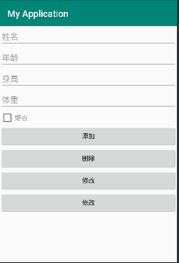
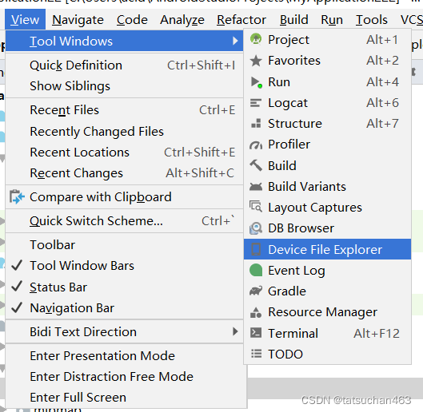
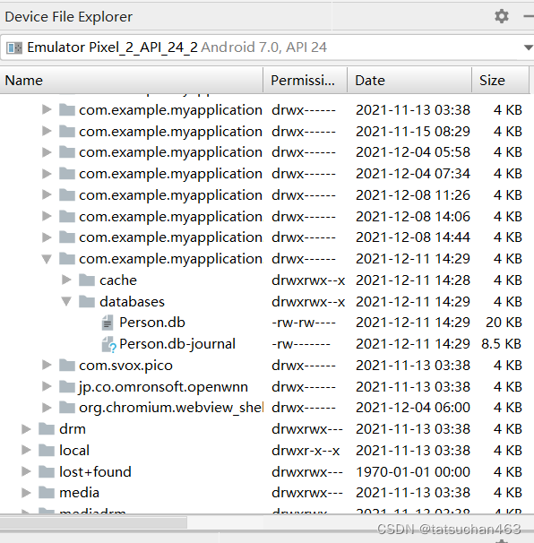
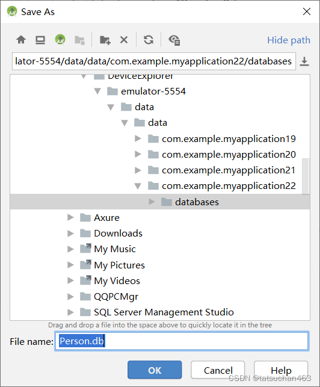
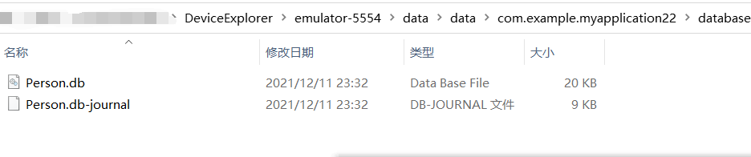
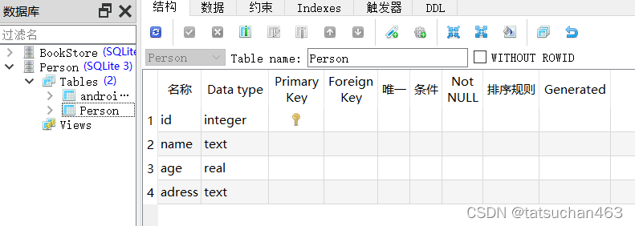

# Android数据库SQLite的使用

## 一、SQLiteOpenHelper 介绍

在 Android 中，操作SQLite主要依靠SQLiteDatabase与 SQLiteOpenHelper 这两个类，其中 SQLiteDatabase 是用于执行数据库操作的类，SQLiteOpenHelper 是 SQLiteDatabase 的一个帮助类，用来管理数据库的创建和版本的更新。由于 SQLieDatase 对象是通过 SOLiteOpenHelper调用方法来获得的，因此下面先讲解SQLiteOpenHelper 再讲解 SQLiteDatabase。

## 二、创建数据库，添加表和记录

#### 1.新建XML布局

```xml
<?xml version="1.0" encoding="utf-8"?>
<LinearLayout xmlns:android="http://schemas.android.com/apk/res/android"
    android:layout_width="match_parent"
    android:layout_height="match_parent"
    android:orientation="vertical">

    <EditText
        android:id="@+id/et_name"
        android:layout_width="match_parent"
        android:layout_height="wrap_content"
        android:hint="姓名"/>

    <EditText
        android:id="@+id/et_age"
        android:layout_width="match_parent"
        android:layout_height="wrap_content"
        android:hint="年龄"/>

    <EditText
        android:id="@+id/et_height"
        android:layout_width="match_parent"
        android:layout_height="wrap_content"
        android:hint="身高"/>

    <EditText
        android:id="@+id/et_weight"
        android:layout_width="match_parent"
        android:layout_height="wrap_content"
        android:hint="体重"/>
    <CheckBox
        android:id="@+id/ck_marred"
        android:layout_width="match_parent"
        android:layout_height="wrap_content"
        android:hint="婚否"/>
    <Button
        android:id="@+id/btn_add"
        android:layout_width="match_parent"
        android:layout_height="wrap_content"
        android:text="添加"/>
    <Button
        android:id="@+id/btn_del"
        android:layout_width="match_parent"
        android:layout_height="wrap_content"
        android:text="删除"/>
    <Button
        android:id="@+id/btn_updata"
        android:layout_width="match_parent"
        android:layout_height="wrap_content"
        android:text="修改"/>
    <Button
        android:id="@+id/btn_select"
        android:layout_width="match_parent"
        android:layout_height="wrap_content"
        android:text="修改"/>

</LinearLayout>
```



### 2.在onCreate方法中绑定UI空间并设置按钮点击监听器

```java
		findViewById(R.id.btn_add).setOnClickListener(this);
        findViewById(R.id.btn_del).setOnClickListener(this);
        findViewById(R.id.btn_updata).setOnClickListener(this);
        findViewById(R.id.btn_select).setOnClickListener(this);
        et_name = findViewById(R.id.et_name);
        et_age = findViewById(R.id.et_age);
        et_height = findViewById(R.id.et_height);
        et_weight = findViewById(R.id.et_weight);
        ck_marred = findViewById(R.id.ck_marred);
```

### 3.重写onClick方法

```java
@Override
    public void onClick(View view) {
        
        switch (view.getId()){

            case R.id.btn_add:
                break;
            case R.id.btn_del:
                break;
            case R.id.btn_updata:
                break;
            case R.id.btn_select:
                break;
        }
    }
```

### 4.新建包database在其下新建一个UserDBHelper类继承SQLiteDatabase抽象方法，并重写其中的两个抽象方法void onCreate(SQLiteDatabase sqLiteDatabase)和onUpgrade(SQLiteDatabase sqLiteDatabase, int i, int i1)

> void onCreate(SQLiteDatabase sqLiteDatabase)
>
> 创建数据库要执行的操作如建表等


### 5.声明两个静态常量:数据库名称和版本号

```java
private static final int DB_VERSION = 1;
private static final String DB_NAME = "user.db";
```

### 6.给UserDBHelper添加构造方法，并调用父类的构造器super();

```java
    private UserDBHelper(Context context){

        super(context,DB_NAME,null,DB_VERSION);
    }
```

- 第一个参数:上下文。
- 第二个参数:数据库名称。
- 第三个参数:游标工厂。
- 第四个参数:数据库名。

### 7.在onCreate（）方法中新建一个String类型的sql变量添加sql语句新建数据库表

```sqlite
CREATE TABLE IF NOT EXISTS user_info (
    _id INTEGER PRIMARY KEY AUTOINCREMENT NOT NULL,
    name VARCHAR NOT NULL,
    age INTEGER NOT NULL,
    height LONG NOT NULL,
    weight FLOAT NOT NULL,
    married INTEGER NOT NULL);
```

### 8.调用sqLiteDatabase.execSQL(sql);执行SQL语句

TABLE_NAME为表名，声明为静态常量

```java
private static final String TABLE_NAME = "user_info";
```

```java
@Override
public void onCreate(SQLiteDatabase sqLiteDatabase) {

    String sql = "CREATE TABLE IF NOT EXISTS "+TABLE_NAME+" (_id INTEGER PRIMARY KEY AUTOINCREMENT NOT NULL,name VARCHAR NOT NULL,age INTEGER NOT NULL,height LONG NOT NULL,weight FLOAT NOT NULL,married INTEGER NOT NULL);";
    sqLiteDatabase.execSQL(sql);
}
```

因为是private私有的构造方法，所以希望将其声明成一个单例模式

### 9.新建UserDBHelper类型的静态变量mHelper

```java
private static UserDBHelper mHelper = null;
```

添加静态方法

```java
//单例模式
public static UserDBHelper getInstance(Context context){

    if(mHelper==null){
        mHelper = new UserDBHelper(context);
    }
    return mHelper;
}
```


### 10.提供两个读和写的实例

```java
private SQLiteDatabase mRDB = null;
private SQLiteDatabase mWDB = null;
```

### 11.提供打开读连接和写连接的方法

```java
//打开读连接
public SQLiteDatabase openReadLink(){

    if(mRDB == null || !mRDB.isOpen()){

        mRDB = mHelper.getReadableDatabase();
    }
    return mRDB;
}
//打开写连接
public SQLiteDatabase openWriteLink(){

    if(mWDB == null || !mWDB.isOpen()){

        mWDB = mHelper.getWritableDatabase();
    }
    return mWDB;
}
```


### 12.提供关闭连接的方法

```java
//关闭连接
public void closeLink(){

    if(mRDB != null && mRDB.isOpen()){
        mRDB.close();
        mRDB = null;
    }
    if(mWDB != null && mWDB.isOpen()){
        mWDB.close();
        mWDB = null;
    }
}
```


### 13.提供一个添加记录的方法形参列表是一条记录的实例。

我们希望每条记录都是一个对象，所以传一个此类型的对象

```java
public void insert(User user){
   
}
```


### 14.创建enity包在其下创建User类用于生成每个记录的对象

将每个字段看做User类的每一个属性

```java
public int id;
public String name;
public int age;
public long height;
public float weight;
public boolean married;
```


### 15.创建一个空参和一个全参的构造器

```java
public User() {
    
}
public User(String name, int age, long height, float weight, boolean married) {
    this.name = name;
    this.age = age;
    this.height = height;
    this.weight = weight;
    this.married = married;
}
```

因为id为自增主键AUTOINCREMENT所以不用再进行添加


### 16.添加toString（）方法

```java
@Override
public String toString() {
    return "User{" +
            "id=" + id +
            ", name='" + name + '\'' +
            ", age=" + age +
            ", height=" + height +
            ", weight=" + weight +
            ", married=" + married +
            '}';
}
```


### 17.再在UserDBHelper类中insert（）方法中执行insert（）

```java
 mWDB.insert(TABLE_NAME,null,contentValues);
```

因为插入是写操作，所以用mWDB去调用insert方法。

- 第一个参数为表名
- 第二个参数是当第三个参数为空时保证sql语句正确所设置的
- 第三个参数不为空则此参数为null，第三个参数为ContentValues类型的值

ContentValues也是键值对应的集合

用put进行添加第一个参数为键值即字段名，第二个为数据

```java
ContentValues contentValues = new ContentValues();
contentValues.put("name",user.name);
contentValues.put("age",user.age);
contentValues.put("weight",user.weight);
contentValues.put("height",user.height);
contentValues.put("married",user.married);
```

insert返回添加记录的行号(long类型)返回-1时添加失败

```java
public long insert(User user){

    ContentValues contentValues = new ContentValues();
    contentValues.put("name",user.name);
    contentValues.put("age",user.age);
    contentValues.put("weight",user.weight);
    contentValues.put("height",user.height);
    contentValues.put("married",user.married);

    return mRDB.insert(TABLE_NAME,null,contentValues);
}
```


### 18.在主Activity中的onStart()方法构建Heaper并打开连接

### 19.在主Activity中的onStop()方法关闭连接

```java
@Override
protected void onStart() {
    super.onStart();
    mHelper = UserDBHelper.getInstance(this);
    mHelper.openReadLink();
    mHelper.openWriteLink();
}

@Override
protected void onStop() {
    super.onStop();
    mHelper.closeLink();
}
```


### 20.点击按钮后可以新建User对象调用insert()方法添加数据

```java
@Override
public void onClick(View view) {

    String name = et_name.getText().toString();
    String age = et_age.getText().toString();
    String height = et_height.getText().toString();
    String weight = et_weight.getText().toString();
    String marred = ck_marred.getText().toString();
    User user = null;
    switch (view.getId()){

        case R.id.btn_add:
            user = new User(name,Integer.parseInt(age),Long.parseLong(height),Float.parseFloat(weight),ck_marred.isChecked());
            long l = mHelper.insert(user);
            if(l>0){
                Toast.makeText(this,"添加成功",Toast.LENGTH_SHORT).show();
            }
            break;
        case R.id.btn_del:
            break;
        case R.id.btn_updata:
            break;
        case R.id.btn_select:
            break;
    }
}
```


## 三、查看数据库


### 1.首先下载SQLiteStudio。下载地址：https://sqlitestudio.pl/

### 2.下载完后可直接找到sqlitestudio.exe运行。

### 3.运行模拟机，在菜单栏找到Device File Explorer选项（在此期间模拟机不要关）。



### 4.右方出现界面，找到/data/data/com.example.myapplication22/databases/Person.db



### 5.右键save as，保存到物理机中，并记住保存时的绝对路径。



### 6.找到Person.db的绝对路径，并且将地址栏的绝对路径复制下来。



### 7.在SQLiteStudio中打开数据库Person.db



然后就可以查看我们自己所创建的数据库和表格了。


## 四、删除表记录 

### 1.在UserDBHelper类中添加deleteByName()方法

通过姓名删除记录

```java
public long deleteByName(String name){

    return mWDB.delete(TABLE_NAME,"name=?",new String[]{name});
}
```

通过写操作调用delete方法其中

- 第一个参数:表名
- 第二个参数:表达式，问号为占位符
- 第三个参数:是占位符所对应的值，因为条件可能有多个
- 返回删除的记录的个数，0为删除失败

通过姓名和年龄删除:

```java
mWDB.delete(TABLE_NAME,"name=? and age=?",new String[]{name,age});
```

删除所有:

```java
mWDB.delete(TABLE_NAME,"1=1",null);
```

### 2.在主Activity中的按钮点击监听器中调用

```java
case R.id.btn_del:
    if(instance.deleteByName("wah")>0){
        Toast.makeText(this,"删除成功",Toast.LENGTH_SHORT).show();
    }else {
        Toast.makeText(this,"删除失败",Toast.LENGTH_SHORT).show();
    }
    break;
```

## 五、修改记录

### 1.在UserDBHelper类中添加deleteByName()方法

```java
public List<User> queryAll(){

        List<User> list = new ArrayList<>();

        //执行记录查询操作，返回结果集的游标
        Cursor cursor = mRDB.query(TABLE_NAME, null, null, null, null, null, null, null);
        //循环取出游标指向的每一条记录
        while (cursor.moveToNext()){

            User user = new User();
            user.id = cursor.getInt(0);
            user.name = cursor.getString(1);
            user.age = cursor.getInt(2);
            user.height = cursor.getLong(3);
            user.weight = cursor.getFloat(4);
            //user.married = cursor.getBlob(5);
            //SQLite没有布尔类型，所以用整形表示
            user.married = ((cursor.getInt(5) == 0)?false:true);

            list.add(user);
        }

        return list;
    }
```

因为返回结果集长度不确定，所以返回类型为List<User>

新建一个集合 `List<User> list = new ArrayList<>();`

用读操作mRDB调用query（）方法，执行记录查询操作，返回结果集的游标

#### 什么是数据库游标？

可以将数据库游标视为指向查询结果中特定行的指针。指针可以从一行移动到下一行。根据游标的类型，您甚至可以将其移动到上一行。

可以这样想：***\*SQL\*******\*结果就像一个袋子\****，你可以一次保存一大堆行，但不能单独保存任何一行；而**游标就像一把镊子**。有了它，你可以把手伸进包里抓一排，然后移到下一个。

> 第一个参数:表名
>
> 第二个参数:
>
> 第三个参数:查找条件，比如按名字查找"name= ?"
>
> 第四个参数:条件的参数，因为可能有多个
>
> 第五个参数:分组
>
> 第六个参数:对分组的信息进行过滤
>
> 第七个参数:排序，默认（null）按添加顺序排序
>
> 第八个参数:分页

调用cursor.moveToNext()判断游标是否指向最后一行

调用cursor.getInt(0)等获取每条记录的每个字段的数据注意数据类型不同调用的方法不同，参数为第几个字段(从0开始)

SQLite没有布尔类型，所以用整形表示user.married = ((cursor.getInt(5) == 0)?false:true);

list.add(user);把每条记录的对象加进去

### 2.在主Activity中的按钮点击监听器中调用

```java
case R.id.btn_select:
                List<User> list = instance.queryAll();
                for (User user1 : list) {
                    Log.d("wang",user1.toString());
                }
                break;
```

模板list.for遍历集合for (User user1 : list) 

调用集合toString()方法输出记录

## 六、事务管理

我们想插入两条数据，但其中一条出错，想让其返回添加失败，可以用事务管理

```java
try {
    mWDB.beginTransaction();
    mRDB.insert(TABLE_NAME,null,contentValues);
    int a = 10/0;//假设添加失败异常
    mRDB.insert(TABLE_NAME,null,contentValues);
    mWDB.setTransactionSuccessful();
}catch (Exception e){
    e.printStackTrace();
}finally {
    mWDB.endTransaction();
}
```

如果没有执行mWDB.setTransactionSuccessful();就认为失败，就回滚掉，即使前面有成功的也会返回失败

## 七、数据库版本升级

当数据库版本private static final int DB_VERSION = 1;发生更新时会调用onUpgrade()

在onUpgrade()中可以更改表结构，比如增加字段等

```java
private static final int DB_VERSION = 2;
```

```java
@Override
public void onUpgrade(SQLiteDatabase sqLiteDatabase, int i, int i1) {

    String sql = "ALTER TABLE "+TABLE_NAME+" ADD COLUMN phone VARCHAR";
    sqLiteDatabase.execSQL(sql);
    sql = "ALTER TABLE "+TABLE_NAME+" ADD COLUMN password VARCHAR";
    sqLiteDatabase.execSQL(sql);
}
```

修改版本，调用onUpgrade方法，增加两个字段phone,password

