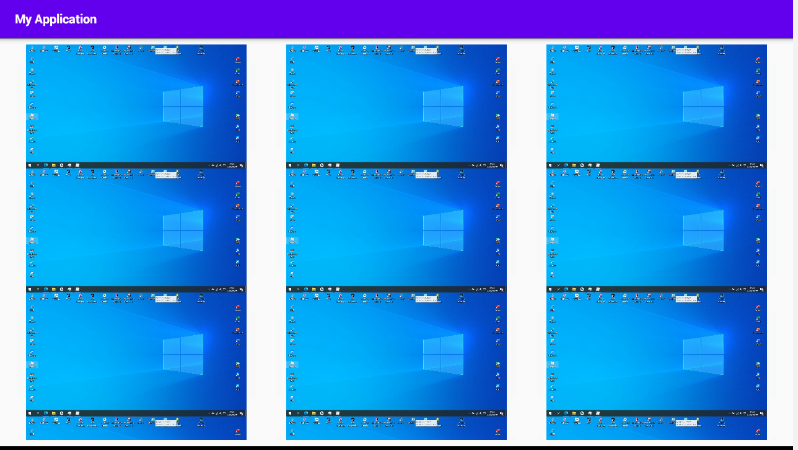
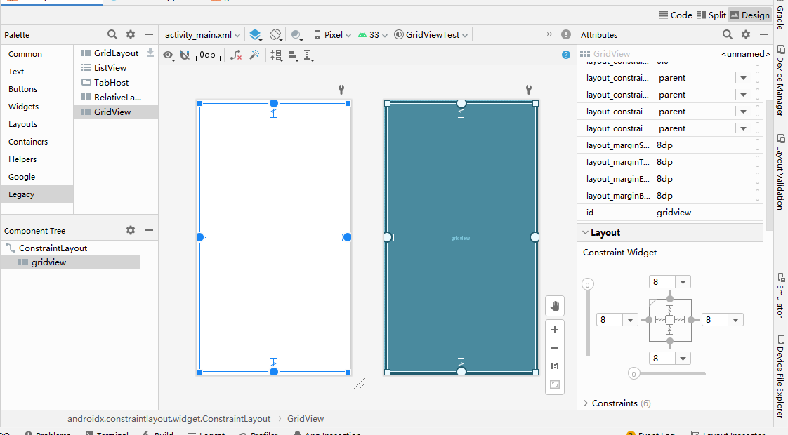

# GridView显示图片动态列表

我们在使用手机的过程中，会看到一些图片配上文字的一些情况，今天我们就来介绍一下安卓控件的GridView

**GridView组件用来以网格方式排列视图，与矩阵类似，当屏幕上有很多元素（文字、图片或其他元素）需要显示时，可以使用该组件**


#### 1.写item的布局：


建议使用线性布局

可以控件居中对齐，每个Grid View会自动裁切成合适大小的

如果只想显示图片，可以只放一张图片然后宽高match_parent，在没有空隙的情况下，是可以实现图片列表的(比如下图水平右间隙)




```xml
<?xml version="1.0" encoding="utf-8"?>
<LinearLayout xmlns:android="http://schemas.android.com/apk/res/android"
    android:layout_width="match_parent"
    android:layout_height="match_parent"
    android:orientation="vertical"
    android:gravity="center">

    <ImageView
        android:id="@+id/iv_gridView_item"
        android:layout_width="match_parent"
        android:layout_height="wrap_content"
        android:layout_marginLeft="8dp"
        android:layout_marginRight="8dp"
        android:adjustViewBounds="true"
        android:src="@drawable/im_zhuomian"/>
    <TextView
        android:id="@+id/tv_gridView_item"
        android:layout_width="wrap_content"
        android:layout_height="wrap_content"
        android:layout_gravity="center"
        android:textSize="32sp"
        android:text="配字"/>
</LinearLayout>
```

效果如下图


```xml
    android:layout_marginLeft="8dp"
    android:layout_marginRight="8dp"
```
用于设置图片左右间距


```xml
android:adjustViewBounds="true"
```

下图解释


除以上无效情况，就是宽和高其中一个为固定值另一个自动大小，会根据固定的值去匹配另一个自动值，使其没有多余的空隙，让ImageView与图片之间没有空隙


#### 2.**主界面的布局文件**：

```xml
<?xml version="1.0" encoding="utf-8"?>
<androidx.constraintlayout.widget.ConstraintLayout xmlns:android="http://schemas.android.com/apk/res/android"
    xmlns:app="http://schemas.android.com/apk/res-auto"
    xmlns:tools="http://schemas.android.com/tools"
    android:layout_width="match_parent"
    android:layout_height="match_parent"
    tools:context=".MainActivity">

    <GridView
        android:id="@+id/gridview"
        android:layout_width="0dp"
        android:layout_height="0dp"
        android:layout_marginStart="8dp"
        android:layout_marginTop="8dp"
        android:layout_marginEnd="8dp"
        android:layout_marginBottom="8dp"
        app:layout_constraintBottom_toBottomOf="parent"
        app:layout_constraintEnd_toEndOf="parent"
        app:layout_constraintHorizontal_bias="0.0"
        app:layout_constraintStart_toStartOf="parent"
        app:layout_constraintTop_toTopOf="parent"
        app:layout_constraintVertical_bias="0.0" />
</androidx.constraintlayout.widget.ConstraintLayout>
```

使用约束布局，控制GridView的上下左右的距离



重要属性

```xml
android:numColumns="3"
```

设置每行有几列

```xml
android:columnWidth="10dp"
```

设置每列有多宽,如果小于实际长度无效


#### 3.创建适配器

继承自BaseAdapter，重写构造器和方法


创建属性

```java
private LayoutInflater layoutInflater;  //用于寻找控件
private Integer[] images;       //定义图片资源数组
private String[] text;      //定义文本资源数组
```


完整代码

```java
package com.example.gridviewtest;

import android.content.Context;
import android.view.LayoutInflater;
import android.view.View;
import android.view.ViewGroup;
import android.widget.BaseAdapter;
import android.widget.ImageView;
import android.widget.TextView;

public class MyAdapter extends BaseAdapter {

    private LayoutInflater layoutInflater;  //用于寻找控件
    private Integer[] images;       //定义图片资源数组
    private String[] text;      //定义文本资源数组

    //创建构造器
    public MyAdapter(Context context, Integer[] images, String[] text) {
        this.layoutInflater = LayoutInflater.from(context);     //获取Context下的在的资源id
        this.images = images;
        this.text = text;
    }

    @Override
    public int getCount() {
        return images.length;   //返回所有数据的条目数
    }

    @Override
    public Object getItem(int i) {
        return images[i];   //返回数组里的资源
    }

    @Override
    public long getItemId(int i) {
        return i;           //返回数组下表,哪个item数
    }

    //通过适配器将数据设置到每个item中
    @Override
    public View getView(int i, View view, ViewGroup viewGroup) {
        //通过该Content下的资源ID去获取view,第一个参数是要找的ID,第二个是用于设置到XML
        View v = layoutInflater.inflate(R.layout.grid_item,null);//找到将要填入GridView的item,将来需要返回设置
        //找到该视图下的控件
        ImageView iv = (ImageView) v.findViewById(R.id.iv_gridView_item);
        TextView tv = (TextView) v.findViewById(R.id.tv_gridView_item);
        iv.setImageResource(images[i]);//设置图片
        tv.setText(text[i]);//设置文本
        return v;   //返回用以设置
    }
}
```

解释说明:

1.原理

**1. BaseAdapter适配器重写 之getView（）：**

**（1）View getview(int position, View convertview, ViewGroup parent )**

**第一个参数position----------该视图在适配器数据中的位置 
第二个参数convertView-----旧视图 
第三个参数parent------------此视图最终会被附加到的父级视图**

***\*特别注意：convertview参数\****

**首先讲下ListView的原理：ListView中的每一个Item显示都需要Adapter调用一次getView的方法，这个方法会传入一个convertView的参数，返回的View就是这个Item显示的View。**

**如果当Item的数量足够大，再为每一个Item都创建一个View对象，必将占用很多内存，创建View对象（mInflater.inflate(R.layout.lv_item, null)；从xml中生成View，这是属于IO操作）也是耗时操作，所以必将影响性能。**

**Android提供了一个叫做\**Recycler(反复循环器)\**的构件，就是当ListView的Item从上方滚出屏幕视角之外，对应Item的View会被缓存到Recycler中，相应的会从下方生成一个Item，而此时调用的getView中的convertView参数就是滚出屏幕的Item的View，所以说convertView 我们可以复用它，这样就省去了new View的大量开销。**

**就是**
**你的listView**
**gridView**
**等等**
**每生成一个item都会调用getView的方法**
**把View的返回出去**
**第一个是你的listview对应的条数**
**下标从0开始**
**第二个是你要返回出去的视图**
**也就是View**
**第三个就是加载对应的xml的**

#### 4.在MainAvtivity中准备资源用来填充

```java
//数据源数组集合
List<String> text;
List<Integer> image;
```


```java
private void initData() {

    image = new ArrayList<Integer>();
    text = new ArrayList<String>();
    for (int i = 1; i <= 90; i++) {
       image.add(R.drawable.im_zhuomian);
       text.add("美图"+i);
    }
}
```

初始化GridView和适配器

```java
gridview = findViewById(R.id.gridview);

myAdapter = new MyAdapter(this,image.toArray(new Integer[image.size()]),
        text.toArray(new String[text.size()]));
```


设置适配器

```java
gridview.setAdapter(myAdapter);
```


完整代码

```java
package com.example.gridviewtest;

import androidx.appcompat.app.AppCompatActivity;

import android.os.Bundle;
import android.widget.GridView;

import java.util.ArrayList;
import java.util.List;

public class MainActivity extends AppCompatActivity {

    //数据源数组集合
    List<String> text;
    List<Integer> image;
    private MyAdapter myAdapter;
    private GridView gridview;

    @Override
    protected void onCreate(Bundle savedInstanceState) {
        super.onCreate(savedInstanceState);
        setContentView(R.layout.activity_main);

        initData();
        gridview = findViewById(R.id.gridview);

        myAdapter = new MyAdapter(this,image.toArray(new Integer[image.size()]),
                text.toArray(new String[text.size()]));

        gridview.setAdapter(myAdapter);
    }

    private void initData() {

        image = new ArrayList<Integer>();
        text = new ArrayList<String>();
        for (int i = 1; i <= 90; i++) {
           image.add(R.drawable.im_zhuomian);
           text.add("美图"+i);
        }
    }
}
```

