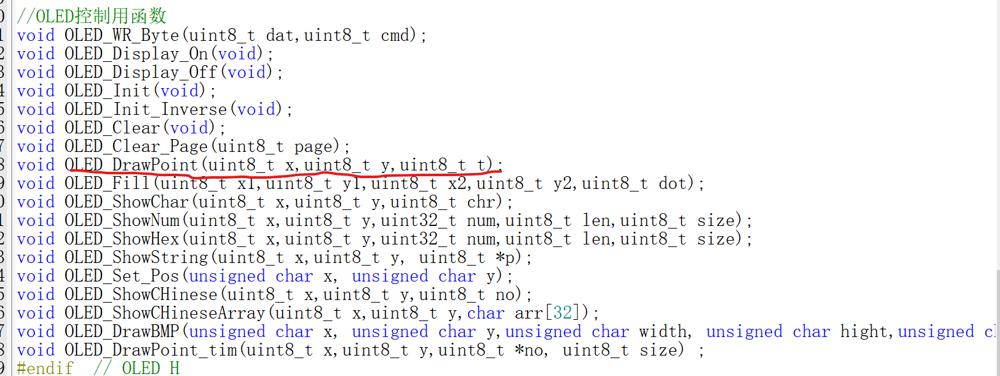

# LoRa模块NB模块0.96OLED画点画线函数和小字体


## 一、画点函数

原文链接

https://blog.csdn.net/ZakiGoGoGo/article/details/126584332

```c
void OLED_DrawPoint(unsigned char x,unsigned char y)
{
       static unsigned char data1;
       data1=(unsigned char)(0x01<<((y%8)));
       OLED_Set_Pos(x, (unsigned char)(y >> 3));
       OLED_WR_Byte((unsigned char)(0xb0 + (y >> 3)),0);
       OLED_WR_Byte((unsigned char)(((x & 0xf0) >> 4) | 0x10),0);
       OLED_WR_Byte((unsigned char)((x & 0x0f) | 0x00),0);
       OLED_WR_Byte(data1,1);
}
```

新大陆库中没有只有画点函数声明没有定义

图



所以我们要自己写画点函数

将上述函数复制到OLED.c中稍作修改将头文件修改，

void OLED_DrawPoint(unsigned char x,unsigned char y);

x和y代表像素数

x:0-127

y:0-63

画点时进行调用即可

## 二、画线函数

原文链接

https://blog.csdn.net/qq_38918366/article/details/106351436

```c
void OLED_DrawLine(unsigned int x1, unsigned int y1, unsigned int x2,unsigned int y2)
{
	unsigned int t; 
	int xerr=0,yerr=0,delta_x,delta_y,distance; 
	int incx,incy,uRow,uCol; 
	delta_x=x2-x1; //计算坐标增量 
	delta_y=y2-y1; 
	uRow=x1; 
	uCol=y1; 
	if(delta_x>0)incx=1; //设置单步方向 
	else if(delta_x==0)incx=0;//垂直线 
	else {incx=-1;delta_x=-delta_x;} 
	if(delta_y>0)incy=1; 
	else if(delta_y==0)incy=0;//水平线 
	else{incy=-1;delta_y=-delta_y;} 
	if( delta_x>delta_y)distance=delta_x; //选取基本增量坐标轴 
	else distance=delta_y; 
	for(t=0;t<=distance+1;t++ )//画线输出 
	{  
		OLED_DrawPoint(uRow,uCol);//画点 
		xerr+=delta_x ; 
		yerr+=delta_y ; 
		if(xerr>distance) 
		{ 
			xerr-=distance; 
			uRow+=incx; 
		} 
		if(yerr>distance) 
		{ 
			yerr-=distance; 
			uCol+=incy; 
		} 
	}  
}    
```

将其复制到OLED.c中，头文件中定义

```c
void OLED_DrawLine(unsigned int x1, unsigned int y1, unsigned int x2,unsigned int y2);
```

即可使用

x1,y1,x2,y2是两点坐标

## 三、字体缩小

字体缩小

先看一下显示字符函数是怎么定义的

```c
//在指定位置显示一个字符,包括部分字符
//x:0~127
//y:0~63
//mode:0,反白显示;1,正常显示				 
//size:选择字体 16/12 
void OLED_ShowChar(uint8_t x,uint8_t y,uint8_t chr,uint8_t size)
{      	
	unsigned char c=0,i=0;	
	c=chr-' ';//得到偏移后的值			
	if(x>Max_Column-1){x=0;y=y+2;}
	if(SIZE ==16)
	{
		OLED_Set_Pos(x,y);	
		for(i=0;i<8;i++)
			OLED_WR_Byte(F8X16[c*16+i],OLED_DATA);
		OLED_Set_Pos(x,y+1);
		for(i=0;i<8;i++)
			OLED_WR_Byte(F8X16[c*16+i+8],OLED_DATA);
	}
	else 
	{	
		OLED_Set_Pos(x,y+1);
		for(i=0;i<6;i++)
			OLED_WR_Byte(F6x8[c][i],OLED_DATA);
	}
}
```

其中的SIZE如果不是16则显示小写的字符

SIZE在.h文件里21行有定义

```c
#define SIZE 16
```

所以只需要把它改成非16就可以非16字符大小是6 * 8的普通大小是8 * 16的，所以以往的普通字符可以显示4行

但是小字符模式可以显示8行数据(因为每一页高8，8*8=64)每行可以显示21.33个字符，显示数字时可以调小间距

所以新大陆有两个字符库，SIZE是16调用标准大小库,非16调用小字库

因为显示字符串，数字函数都是显示字符函数的改版所以小字模式同样适用

