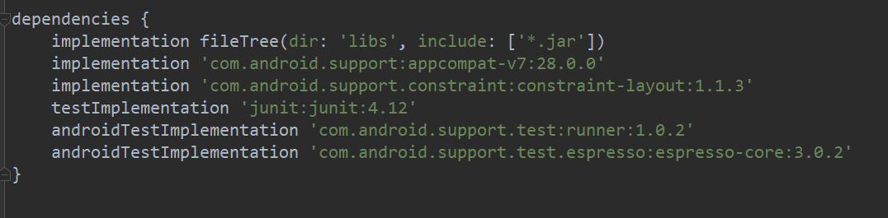
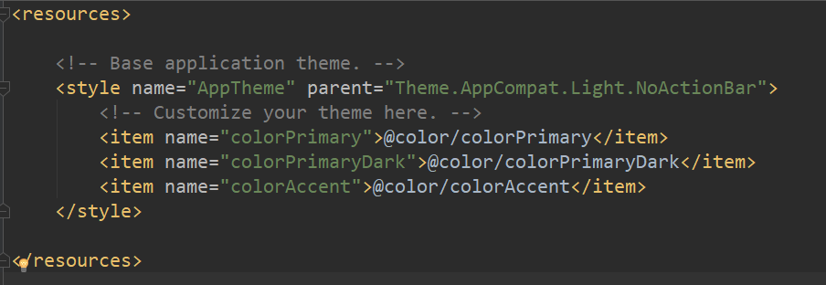
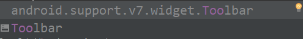
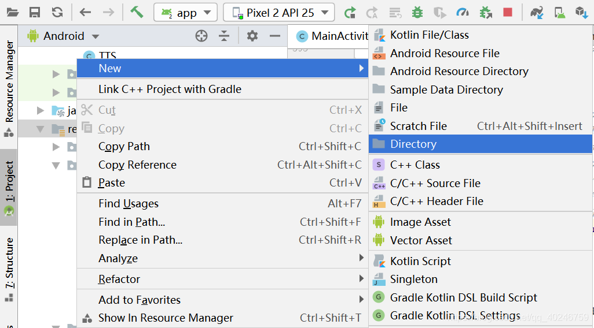
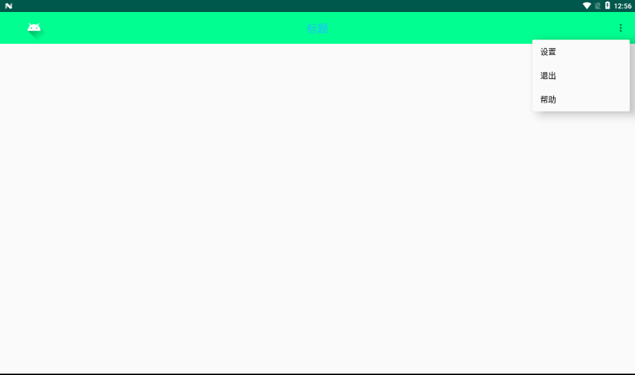
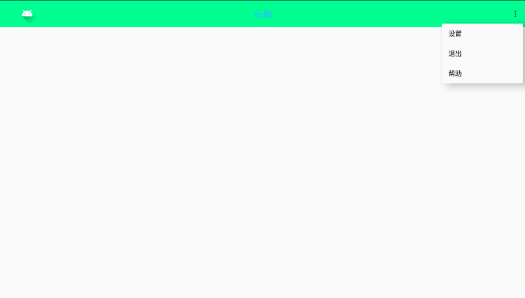

# ToolBar在标题栏右上角实现菜单


## 一、隐藏的菜单

### 1.在模块的gradle中添加appcompat-v7的兼容包

```java
implementation 'com.android.support:appcompat-v7:28.0.0'
```



## 2.Toolbar XML属性

| 变量               | 说明               |
| ------------------ | ------------------ |
| app:logo           | 定义logo图标       |
| app:navigationlcon | 定义导航按键的图标 |
| app:theme          | 定义app的主题      |
| app:popupTheme     | 定义弹出菜单的主题 |
| app:title          | 定义标题文字       |
| app:subtitle       | 定义副标题文字     |
| app:titleTextColor | 定义标题文字颜色   |

### 3.去除系统自带标题栏

在styles.xml中，更改继承父节点

```xml
parent="Theme.AppCompat.Light.NoActionBar"
```



### 4.在布局文件中添加ToolBar控件

高度为"?attr/actionBarSize"表示原来默认原来的标题高度



并非系统自带的Toolbar而是android.support.v7.widget.Toolbar中的

标题title = “ ”为了覆盖原有标题

用TextView代替标题并居中

```xml
<android.support.v7.widget.Toolbar
        android:id="@+id/toolbar"
        android:layout_width="match_parent"
        android:layout_height="?attr/actionBarSize"
        app:title=" "
        android:background="#00ff90"
        app:logo="@drawable/ic_launcher_foreground">

        <TextView
            android:layout_width="wrap_content"
            android:layout_height="wrap_content"
            android:text="标题"
            android:textSize="22sp"
            android:textColor="#20c0ff"
            android:layout_gravity="center"/>
    </android.support.v7.widget.Toolbar>
```


### 5.使用ToolBar替换原来的ActionBar

在onCreate()中添加替换原来的ActionBar

```java
Toolbar toolbar = findViewById(R.id.toolbar);
setSupportActionBar(toolbar);
```

### 6.创建弹出的菜单

首先按照下图的指示新建一个menu文件夹。然后在menu文件夹下新建一个menu.xml的文件。名称必须为menu。



以下为xml代码：

```html
<?xml version="1.0" encoding="utf-8"?>
<menu xmlns:android="http://schemas.android.com/apk/res/android"
    xmlns:app="http://schemas.android.com/apk/res-auto">

    <item
        android:id="@+id/setting"
        android:title="设置"
        android:icon="@drawable/ic_launcher_foreground"
        app:showAsAction="never"
        android:orderInCategory="1"/>
    <item
        android:id="@+id/exit"
        android:title="退出"
        android:icon="@drawable/ic_launcher_foreground"
        app:showAsAction="never"
        android:orderInCategory="2"/>
    <item
        android:id="@+id/help"
        android:title="帮助"
        android:icon="@drawable/ic_launcher_foreground"
        app:showAsAction="never"
        android:orderInCategory="3"/>

</menu>
```

android:orderInCategory为排列序号

android:title是菜单选项标题

android:icon为选项图标

  showAsAction属性共有五个值：ifRoom、never、always、withText、collapseActionView，可以混合使用。

```
ifRoom    会显示在Item中，但是如果已经有4个或者4个以上的Item时会隐藏在溢出列表中。当然个数并不仅仅局限于4个，依据屏幕的宽窄而定    
never    永远不会显示。只会在溢出列表中显示，而且只显示标题，所以在定义item的时候，最好把标题都带上。    
always    无论是否溢出，总会显示。    
withText    withText值示意Action bar要显示文本标题。Action bar会尽可能的显示这个标题，但是，如果图标有效并且受到Action bar空间的限制，文本标题有可能显示不全。  
collapseActionView      声明了这个操作视窗应该被折叠到一个按钮中，当用户选择这个按钮时，这个操作视窗展开。否则，这个操作视窗在默认的情况下是可见的，并且即便在用于不适用的时候，也要占据操作栏的有效空间。
一般要配合ifRoom一起使用才会有效果。
```
###    7.在Activity中使用menu菜单

然后在想要显示三个点的页面的Java代码中添加下面的代码，即可

```java
 @Override
    public boolean onCreateOptionsMenu(Menu menu) {
        getMenuInflater().inflate(R.menu.menu,menu);
        return true;
    }

```

### 8.解决菜单按钮被覆盖的问题

只需要在values文件夹下的styles中，AppTheme下添加

```html
<item name="overlapAnchor">false</item>
```



### 9.添加点击事件监听器

重写onOptionsItemSelected()进行判断调用等

```java
@Override
    public boolean onOptionsItemSelected(MenuItem item) {

        switch (item.getItemId()){

            case R.id.setting:
                Toast.makeText(this,"打开设置",Toast.LENGTH_SHORT).show();
                break;
            case R.id.exit:
                Toast.makeText(this,"退出",Toast.LENGTH_SHORT).show();
                break;
            case R.id.help:
                Toast.makeText(this,"打开帮助",Toast.LENGTH_SHORT).show();
                break;
        }
        return super.onOptionsItemSelected(item);
    }
```


### 10.解决菜单内选项不能显示图标



随人已经设置icon但是不能显示

```java
/**
     * 解决不显示menu icon的问题
     * @param menu
     * @param flag
     */
    private void setIconsVisible(Menu menu, boolean flag) {
        //判断menu是否为空
        if(menu != null) {
            try {
                //如果不为空,就反射拿到menu的setOptionalIconsVisible方法
                Method method = menu.getClass().getDeclaredMethod("setOptionalIconsVisible", Boolean.TYPE);
                //暴力访问该方法
                method.setAccessible(true);
                //调用该方法显示icon
                method.invoke(menu, flag);
            } catch (Exception e) {
                e.printStackTrace();
            }
        }
    }
```

在onCreateOptionsMenu()中调用即可

```java
setIconsVisible(menu,true);
```

```java
@Override
    public boolean onCreateOptionsMenu(Menu menu) {
        getMenuInflater().inflate(R.menu.menu,menu);
        setIconsVisible(menu,true);
        return true;
    }
```


## 二、不隐藏的菜单

只要将item的android:showAsAction属性设置为always让其显示不被隐藏即可

再设置android:icon属性添加图标

这次调用android:icon属性不会不显示，因此不用再额外去写别的方法了

```java
<?xml version="1.0" encoding="utf-8"?>
<menu xmlns:android="http://schemas.android.com/apk/res/android"
    xmlns:app="http://schemas.android.com/apk/res-auto">

    <item
        android:id="@+id/setting"
        android:title="设置"
        android:icon="@drawable/ic_launcher_foreground"
        app:showAsAction="never"
        android:orderInCategory="1"/>
    <item
        android:id="@+id/exit"
        android:title="退出"
        android:icon="@drawable/ic_launcher_foreground"
        app:showAsAction="never"
        android:orderInCategory="2"/>
    <item
        android:id="@+id/help"
        android:title="帮助"
        android:icon="@drawable/ic_launcher_foreground"
        app:showAsAction="never"
        android:orderInCategory="3"/>
    <item
        android:id="@+id/photo"
        android:title="拍照"
        app:showAsAction="always"
        android:icon="@drawable/photo"
        />

</menu>
```

```java
@Override
public boolean onCreateOptionsMenu(Menu menu) {
    getMenuInflater().inflate(R.menu.menu,menu);
    //setIconsVisible(menu,true);不用调用
    return true;
}
```

```java
@Override
public boolean onOptionsItemSelected(MenuItem item) {

    switch (item.getItemId()){

        case R.id.setting:
            Toast.makeText(this,"打开设置",Toast.LENGTH_SHORT).show();
            break;
        case R.id.exit:
            Toast.makeText(this,"退出",Toast.LENGTH_SHORT).show();
            break;
        case R.id.help:
            Toast.makeText(this,"打开帮助",Toast.LENGTH_SHORT).show();
            break;
        case R.id.photo:
            Toast.makeText(this,"拍照",Toast.LENGTH_SHORT).show();
            break;
    }
    return super.onOptionsItemSelected(item);
}
```

## 三、推荐阅读

https://www.jianshu.com/p/3cd563a377ff