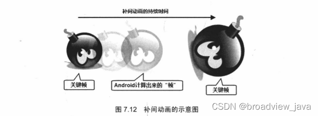
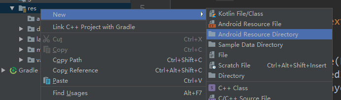
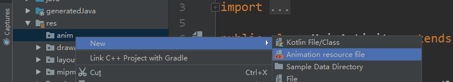
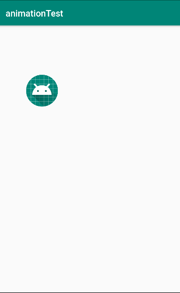
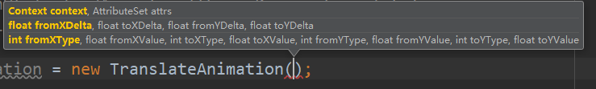
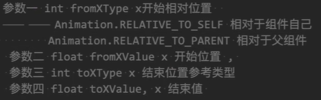

# 安卓开发---动画(animation)

## 一、补间动画

### 1.补间动画介绍

Android三种动画中的第二种——补间动画(Tween)，和帧动画不同，帧动画 是通过连续播放图片来模拟动画效果，而补间动画开发者只需指定**动画开始**，以及**动画结束**"关键帧"， 而动画变化的"中间帧"则由系统计算并补齐。如下为示意图：



​     对于补间动画而言，开发者无需“逐一”定义的过程中的每一帧，他只需要定义动画的开始和结束的关键帧，并指定动画的持续时间即可。

### 2. 补间动画的分类

-  AlphaAnimation：透明度渐变效果，创建时许指定开始以及结束透明度，还有动画的持续 时间，透明度的变化范围(0,1)，0是完全透明，1是完全不透明；对应<alpha/>标签！


-   ScaleAnimation：缩放渐变效果，创建时需指定开始以及结束的缩放比，以及缩放参考点， 还有动画的持续时间；对应<scale/>标签！


-   TranslateAnimation：位移渐变效果，创建时指定起始以及结束位置，并指定动画的持续 时间即可；对应<translate/>标签！


-   RotateAnimation：旋转渐变效果，创建时指定动画起始以及结束的旋转角度，以及动画 持续时间和旋转的轴心；对应<rotate/>标签


-  AnimationSet：组合渐变，就是前面多种渐变的组合，对应<set/>标签

### 3.实现方式有两种：xml文件 和 java代码

### 4.平移(XML)

####   1、res 下 创建 anim 文件夹，并创建 xxx.xml 文件





代码内容

```xml
<?xml version="1.0" encoding="utf-8"?>
<set xmlns:android="http://schemas.android.com/apk/res/android">

        <translate
        android:fromXDelta="0"
        android:toXDelta="500"
        android:fromYDelta="0"
        android:toYDelta="900"
        android:duration="3000"/>
        <translate/>
</set>
```

- fromXDelta：x轴起始位置

- fromYDelta：Y轴起始位置

- toXDelta：x轴结束位置

- roYDelta：Y轴结束位置
- duration：移动速度 （不会自动补全，建议背过手写）

#### 2.在java中加载XML

```java
Animation animation = AnimationUtils.loadAnimation(this, R.anim.translate);
```

调用AnimationUtils工具类的loadAnimation方法 绑定animation和xml文件

#### 3.开启动画

```java
iv_photo.startAnimation(animation);
```

用图片对象调用startAnimation方法开启动画



### 4.平移（java代码）

#### 1.创建实例TranslateAnimation






```java
TranslateAnimation translateAnimation = new TranslateAnimation(
                Animation.RELATIVE_TO_SELF,0,
                Animation.RELATIVE_TO_PARENT,0.1f,
                Animation.RELATIVE_TO_SELF,0,
                Animation.RELATIVE_TO_SELF,1
        );
```

RELATIVE_TO_SELF：相对于自己移动几个单位

RELATIVE_TO_PARENT：相对于父视图移动几个单位

想要传小数后加f

#### 2.属性设置

```java
translateAnimation.setDuration(2000);//持续时间
translateAnimation.setFillAfter(true);//动画结束后保留最后一帧
```

#### 3.开启动画

```java
iv_photo.startAnimation(translateAnimation);
```

### 5.透明度(XML)

####   1、res 下 创建 anim 文件夹，并创建 xxx.xml 文件


代码内容

```xml
<?xml version="1.0" encoding="utf-8"?>
<set xmlns:android="http://schemas.android.com/apk/res/android">


    <alpha android:fromAlpha="1" android:toAlpha="0" android:duration="2000"/>
    
</set>
```

- fromAlpha起始透明度(1为不透明，0为透明)

- toAlpha结束透明度(1为不透明，0为透明)

- duration：变换速度 （不会自动补全，建议背过手写）

#### 2.在java中加载XML

```java
Animation animation = AnimationUtils.loadAnimation(this, R.anim.alpha);
```

调用AnimationUtils工具类的loadAnimation方法 绑定animation对象和xml文件

#### 3.设置属性

```java
animation.setFillAfter(true);//动画结束后保留最后一帧
```

#### 4.开启动画

```java
iv_photo.startAnimation(animation);
```

用图片对象调用startAnimation方法开启动画


### 5.透明度（java代码）

#### 1.创建实例AlphaAnimation


```java
AlphaAnimation alphaAnimation = new AlphaAnimation(1,0);
```

第一个参数:开始透明度(1为不透明，0为透明)

第二个参数:结束透明度(1为不透明，0为透明)

#### 2.属性设置

```java
alphaAnimation.setDuration(3000);//持续时间
alphaAnimation.setFillAfter(true);//动画结束后保留最后一帧
```

#### 3.开启动画

```java
iv_photo.startAnimation(alphaAnimation);
```

### 6.缩放(XML)

####   1、res 下 创建 anim 文件夹，并创建 xxx.xml 文件


代码内容

```xml
<?xml version="1.0" encoding="utf-8"?>
<set xmlns:android="http://schemas.android.com/apk/res/android">

    <scale
        android:fromXScale="0.2"
        android:toXScale="1.5"
        android:fromYScale="0.2"
        android:toYScale="1.5"
        android:pivotX="50%"
        android:pivotY="50%"
        android:duration="2000"/>

</set>
```

属性解释：

```java
    fromXScale/fromYScale：沿着X轴/Y轴缩放的起始比例 两个0.2是开始时图像以原图0.2倍大小

    toXScale/toYScale：沿着X轴/Y轴缩放的结束比例  两个1.5是结束时图像以原图1.5倍大小

    pivotX/pivotY：缩放的中轴点X/Y坐标，即距离自身左边缘的位置，比如50%就是以图像的 中心为中轴点 两个0%是左上角开始，两个100%是右上角开始
```


#### 2.在java中加载XML

```java
Animation animation = AnimationUtils.loadAnimation(this, R.anim.scale);
```

调用AnimationUtils工具类的loadAnimation方法 绑定animation对象和xml文件

#### 3.设置属性

```java
animation.setFillAfter(true);//动画结束后保留最后一帧
```

#### 4.开启动画

```java
iv_photo.startAnimation(animation);
```

用图片对象调用startAnimation方法开启动画


### 6.缩放（java代码）

#### 1.创建实例ScaleAnimation


```java
ScaleAnimation animation = new ScaleAnimation(0.2f,1.5f,0.2f,1.5f,
                Animation.RELATIVE_TO_SELF,0.5f, Animation.RELATIVE_TO_SELF,0.5f);
```

使用java代码的方式创建ScaleAnimation，传入八个参数，fromX、toX、fromY、toY和pivotXType、pivotXValue、pivotYType、pivotYValue，使用如下构造方法。
参数说明：
fromX：动画开始前在X坐标的大小。
toX：动画结束后在X坐标的大小。
fromY：动画开始前在Y坐标的大小。
toY：动画结束后在Y坐标的大小。
pivotXType：缩放中心点的X坐标类型。取值范围为ABSOLUTE、RELATIVE_TO_SELF、RELATIVE_TO_PARENT。
pivotXValue：缩放中心点的X坐标值。当pivotXType==ABSOLUTE时，表示绝对位置；否则表示相对位置，1.0表示100%。
pivotYType：缩放中心点的Y坐标类型。
pivotYValue：缩放中心点的Y坐标。

#### 2.属性设置

```java
                animation.setFillAfter(true);
                animation.setDuration(3000);
```

#### 3.开启动画

```java
iv_photo.startAnimation(animation);
```

### 

### 7.旋转(XML)

####   1、res 下 创建 anim 文件夹，并创建 xxx.xml 文件


代码内容

```xml
<?xml version="1.0" encoding="utf-8"?>
<set xmlns:android="http://schemas.android.com/apk/res/android">

    <rotate android:fromDegrees="0" android:toDegrees="360" android:pivotX="50%" android:pivotY="50%"/>
</set>
```

属性解释：


pivotX和pivotY是旋转点0%为左上角100%为右下角

#### 2.在java中加载XML

```java
Animation animation = AnimationUtils.loadAnimation(this, R.anim.rotate);
```

调用AnimationUtils工具类的loadAnimation方法 绑定animation对象和xml文件

#### 3.设置属性

```java
        animation.setFillAfter(true);
        animation.setDuration(3000);
```

#### 4.开启动画

```java
iv_photo.startAnimation(animation);
```

用图片对象调用startAnimation方法开启动画


### 7.旋转（java代码）

#### 1.创建实例ScaleAnimation

!

```java
RotateAnimation rotateAnimation = new RotateAnimation(0,360,Animation.RELATIVE_TO_SELF,0.5f,
                Animation.RELATIVE_TO_SELF,0.5f);
```


参数说明：
这里面大部分参数已经在上面介绍过了，重点说下pivotXType与pivotYType

int pivotXType,  动画在X轴相对于物件位置类型，与下面的pivotXValue结合，确定X轴上旋转中心。

可能值为：Animation.ABSOLUTE，Animation.RELATIVE_TO_SELF, Animation.RELATIVE_TO_PARENT

如果pivotXType=Animation.ABSOLUTE，则此参数为旋转中心在屏幕上X轴的值；

如果pivotXType=Animation.RELATIVE_TO_PARENT，则参数pivotXValue为旋转中心在父控件水平位置百分比，如0.5表示在父控件水平方向中间位置；
如果pivotXType=Animation.RELATIVE_TO_SELF，则参数pivotXValue为旋转中心在控件自身水平位置百分比，如果X和Y的Value都设置为0.5，则该控件以自身中心旋转。

#### 2.属性设置

```java
 rotateAnimation.setFillAfter(true);
 rotateAnimation.setDuration(3000);
```

#### 3.开启动画

```java
iv_photo.startAnimation(rotateAnimation);
```

### 

### 