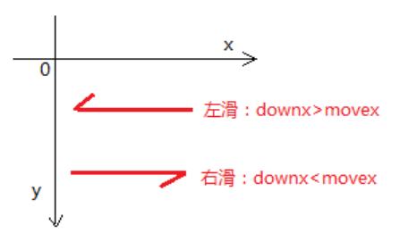
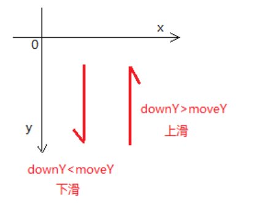
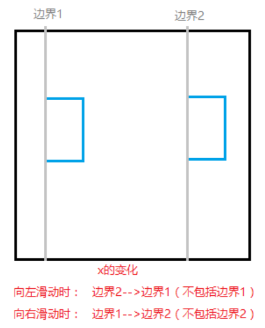
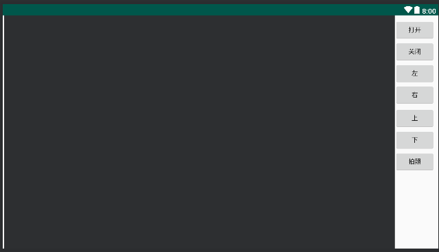
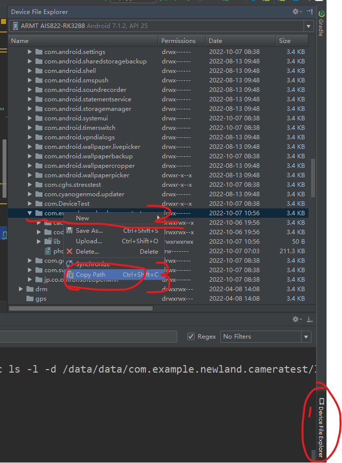
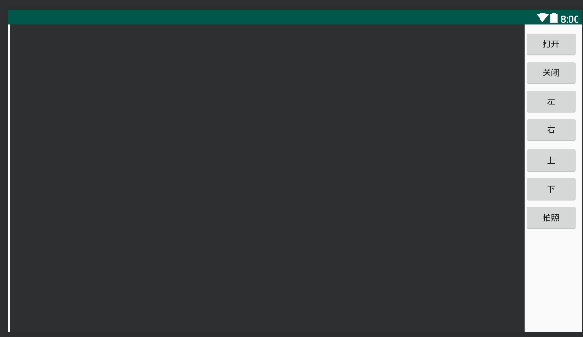
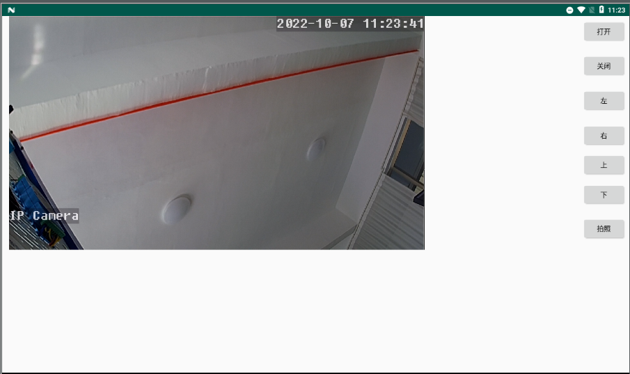

# 安卓调用摄像头


## 一、认识TextureView

TextureView能够用来显示内容流。这样一个内容流比如能够视频或者OpenGL的场景。内容流能够来自本应用程序以及其它进程。

Textureview必须在硬件加速开启的窗体中。

## 二、认识onTouch触摸事件

### onTouch和onClick

onClick 的过程是手指按下和抬起的过程（中间，手指抖动会产生移动），可以将onClick看做是一种特殊的onTouch。如果onTouch 没有消费掉触摸事件（没有return true），在onTouch后， 紧接着会执行onClick事件；如果onTouch消费掉了触摸事件（return true），后面将不会再执行onClick事件
需求较为复杂时，不仅需要touch事件也需要点击，甚至是长按事件，可以在onTouch中判断要进行哪一种事件（根据触摸的时间，距离等来判断）

### 获取位置

使用`event.getX();`、`event.getY();`来获取位置（手指按下，移动或者是抬起时的位置）。通过位置来判断手指滑动的方向







在左右滑动的过程中，需要对控件进行位置更改的，每一次更改位置，都需要保证将要移动到的位置需要在上面的x变化中，大于或者小于两边的边界值时，就取边界值

### onTouch回调方法

onTouch可以有两个参数，一个是View，一个是MotionEvent，View表示受到Touch事件的view对象，MotionEvent包含的事件的详细信息，例如触摸点的信息，触摸事件类型的信息等。

### 初步了解MotionEvent

```java
 public static final int ACTION_DOWN = 0;单点触摸动作
 public static final int ACTION_UP = 1;单点触摸离开动作
 public static final int ACTION_MOVE = 2;触摸点移动动作
 public static final int ACTION_CANCEL = 3;触摸动作取消
 public static final int ACTION_OUTSIDE = 4;触摸动作超出边界
 public static final int ACTION_POINTER_DOWN = 5;多点触摸动作
 public static final int ACTION_POINTER_UP = 6;多点离开动作
 //以下是一些非touch事件
 public static final int ACTION_HOVER_MOVE = 7;
 public static final int ACTION_SCROLL = 8;
 public static final int ACTION_HOVER_ENTER = 9;
 public static final int ACTION_HOVER_EXIT = 10;
```

## 三、导入java包和so文件

### 1.将jar包复制到libs文件夹下

，将so文件连同上级文件夹复制到jniLibs目录下，在'src/main/jniLibs'下新建文件夹

按照以往都是复制到libs文件夹下再添加

```xml
sourceSets {
    main {
        jniLibs.srcDirs = ['src/main/jniLibs']
    }
}
```

但是这次不行，一定要单独新建

### 2.新建布局文件

建议直接使用约束布局拖动



其中播放视频流的控件是TextureView

### 3.打开摄像头

```java
cameraManager = CameraManager.getInstance();
cameraManager.setupInfo(textureView, "admin", "admin", "192.168.1.100", "1");
cameraManager.openCamera();
```

如果出现闪退情况查看so文件是否新建文件夹，不新建文件夹会出现此情况

### 4.关闭摄像头

```java
if(cameraManager!=null){
    cameraManager.releaseCamera();
}
```

调用releaseCamera()方法，先判断是否为空避免空指针

### 5.摄像头的移动

给按钮设置OnTouchListener的触摸监听器，如果设置点击事件监听器，则会转起来不停

```java
findViewById(R.id.bt_up).setOnTouchListener(this);
findViewById(R.id.bt_down).setOnTouchListener(this);
findViewById(R.id.bt_left).setOnTouchListener(this);
findViewById(R.id.bt_right).setOnTouchListener(this);
```

回调方法

```java
    @Override
    public boolean onTouch(View view, MotionEvent motionEvent) {

        int action = motionEvent.getAction();
        ptz = null;
        if(action == MotionEvent.ACTION_CANCEL || action == MotionEvent.ACTION_UP){
            ptz = PTZ.Stop;
        } else if (action == MotionEvent.ACTION_DOWN) {

            switch (view.getId()){

                case R.id.bt_up:
                    ptz = PTZ.Up;
                    break;
                case R.id.bt_down:
                    ptz = PTZ.Down;
                    break;
                case R.id.bt_left:
                    ptz = PTZ.Left;
                    break;
                case R.id.bt_right:
                    ptz = PTZ.Right;
                    break;
            }
        }
        cameraManager.controlDir(ptz);
        return false;
    }
```

参数

- view:记录那个控件调用

- motionEvent:记录触摸属性

motionEvent调用getAction()得到触摸属性判断action == MotionEvent.ACTION_CANCEL || action == MotionEvent.ACTION_UP如果触摸取消或者单机取消则停止执行ptz = PTZ.Stop;

判断action == MotionEvent.ACTION_DOWN如果触摸按下则判断是什么方向的(id)在赋值不同的属性

最后调用controlDir(ptz)执行操作，里面传参PTZ类型

在开始也是新建一个PTZ判断是否按下并赋值PTZ，最后调用controlDir(ptz)执行操作

### 6.拍照

调用第二步的capture（String path,Stirng fileName）方法来截图

```java
cameraManager.capture("/data/data/com.example.newland.cameratest","photo.PNG");
```

参数是文件路径

(保存到应用内部不用获取权限，同时其他应用也访问不到)

内部路径一般是data/data/包名

可以这样复制包名



第二个参数是文件名 一定要加后缀

## 四、全部代码

### java代码

```java
package com.example.newland.cameratest;

import android.support.v7.app.AppCompatActivity;
import android.os.Bundle;
import android.view.MotionEvent;
import android.view.TextureView;
import android.view.View;
import android.widget.Button;
import android.widget.LinearLayout;

import com.newland.CameraManager;
import com.newland.PTZ;

public class MainActivity extends AppCompatActivity implements View.OnClickListener, View.OnTouchListener {

    private TextureView textureView;
    private CameraManager cameraManager;
    private PTZ ptz;

    @Override
    protected void onCreate(Bundle savedInstanceState) {
        super.onCreate(savedInstanceState);
        setContentView(R.layout.activity_main);

        initView();
        initCam();
    }

    private void initCam() {

        cameraManager = CameraManager.getInstance();
    }

    private void initView() {

        textureView = findViewById(R.id.textureView);
        findViewById(R.id.bt_open).setOnClickListener(this);
        findViewById(R.id.bt_close).setOnClickListener(this);
        findViewById(R.id.bt_photo).setOnClickListener(this);
        findViewById(R.id.bt_up).setOnTouchListener(this);
        findViewById(R.id.bt_down).setOnTouchListener(this);
        findViewById(R.id.bt_left).setOnTouchListener(this);
        findViewById(R.id.bt_right).setOnTouchListener(this);
    }

    @Override
    public void onClick(View view) {

        switch (view.getId()){

            case R.id.bt_open:
                cameraManager.setupInfo(textureView, "admin", "admin", "192.168.1.100", "1");
                cameraManager.openCamera();
                break;
            case R.id.bt_close:
                if(cameraManager!=null){
                    cameraManager.releaseCamera();
                }
                break;
            case R.id.bt_photo:
               cameraManager.capture("/data/data/com.example.newland.cameratest","photo.PNG");
                break;

        }
    }

    @Override
    public boolean onTouch(View view, MotionEvent motionEvent) {

        int action = motionEvent.getAction();
        ptz = null;
        if(action == MotionEvent.ACTION_CANCEL || action == MotionEvent.ACTION_UP){
            ptz = PTZ.Stop;
        } else if (action == MotionEvent.ACTION_DOWN) {

            switch (view.getId()){

                case R.id.bt_up:
                    ptz = PTZ.Up;
                    break;
                case R.id.bt_down:
                    ptz = PTZ.Down;
                    break;
                case R.id.bt_left:
                    ptz = PTZ.Left;
                    break;
                case R.id.bt_right:
                    ptz = PTZ.Right;
                    break;
            }
        }
        cameraManager.controlDir(ptz);
        return false;
    }
}
```

### XML代码

xml不展示了都是拖出来的



### 运行行效果



## 五、几个问题

1.so文件为什么只能建文件夹才可以运行

2.TextureView的大小缩放控制不准

3.TextureView释放摄像头后最后一帧画面不能去除

4.截图保存路径为外部相册

5.应用内部插查看截图

6.人脸识别SDK？

7.数据库SQLite保存截图