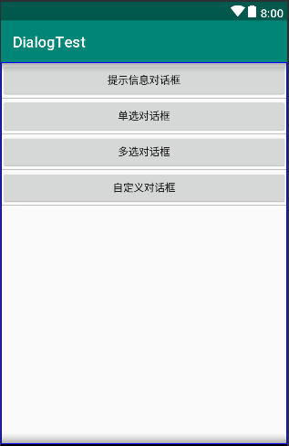

# 对话框

```java
package com.example.newland.dialogtest;

import android.os.Bundle;
import android.support.v7.app.AppCompatActivity;
import android.view.View;

public class MainActivity extends AppCompatActivity implements View.OnClickListener {

    @Override
    protected void onCreate(Bundle savedInstanceState) {
        super.onCreate(savedInstanceState);
        setContentView(R.layout.activity_main);

        findViewById(R.id.btn_ShowMsgDlg).setOnClickListener(this);
        findViewById(R.id.btn_ShowSingleDlg).setOnClickListener(this);
        findViewById(R.id.btn_ShowMultiDlg).setOnClickListener(this);
        findViewById(R.id.btn_ShowCustomDlg).setOnClickListener(this);
    }

    @Override
    public void onClick(View view) {

        switch (view.getId()){
            case R.id.btn_ShowMsgDlg:
                ShowMsgDlg();
                break;
            case R.id.btn_ShowSingleDlg:
                ShowSingleDlg();
                break;
            case R.id.btn_ShowMultiDlg:
                ShowMultiDlg();
                break;
            case R.id.btn_ShowCustomDlg:
                ShowCustomDlg();
                break;
        }
    }

    private void ShowCustomDlg() {

    }

    private void ShowMultiDlg() {

    }

    private void ShowSingleDlg() {

    }

    private void ShowMsgDlg() {

    }
}
```

```html
<?xml version="1.0" encoding="utf-8"?>
<LinearLayout xmlns:android="http://schemas.android.com/apk/res/android"
    android:layout_width="match_parent"
    android:layout_height="match_parent"
    android:orientation="vertical">

    <Button
        android:id="@+id/btn_ShowMsgDlg"
        android:layout_width="match_parent"
        android:layout_height="wrap_content"
        android:text="提示信息对话框"/>

    <Button
        android:id="@+id/btn_ShowSingleDlg"
        android:layout_width="match_parent"
        android:layout_height="wrap_content"
        android:text="单选对话框"/>

    <Button
        android:id="@+id/btn_ShowMultiDlg"
        android:layout_width="match_parent"
        android:layout_height="wrap_content"
        android:text="多选对话框"/>

    <Button
        android:id="@+id/btn_ShowCustomDlg"
        android:layout_width="match_parent"
        android:layout_height="wrap_content"
        android:text="自定义对话框"/>


</LinearLayout>
```



## 一、提示信息对话框

