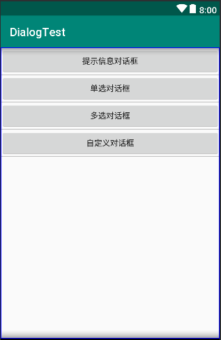

# 对话框

```java
package com.example.newland.dialogtest;

import android.os.Bundle;
import android.support.v7.app.AppCompatActivity;
import android.view.View;

public class MainActivity extends AppCompatActivity implements View.OnClickListener {

    @Override
    protected void onCreate(Bundle savedInstanceState) {
        super.onCreate(savedInstanceState);
        setContentView(R.layout.activity_main);

        findViewById(R.id.btn_ShowMsgDlg).setOnClickListener(this);
        findViewById(R.id.btn_ShowSingleDlg).setOnClickListener(this);
        findViewById(R.id.btn_ShowMultiDlg).setOnClickListener(this);
        findViewById(R.id.btn_ShowCustomDlg).setOnClickListener(this);
    }

    @Override
    public void onClick(View view) {

        switch (view.getId()){
            case R.id.btn_ShowMsgDlg:
                ShowMsgDlg();
                break;
            case R.id.btn_ShowSingleDlg:
                ShowSingleDlg();
                break;
            case R.id.btn_ShowMultiDlg:
                ShowMultiDlg();
                break;
            case R.id.btn_ShowCustomDlg:
                ShowCustomDlg();
                break;
        }
    }

    private void ShowCustomDlg() {

    }

    private void ShowMultiDlg() {

    }

    private void ShowSingleDlg() {

    }

    private void ShowMsgDlg() {

    }
}
```

```html
<?xml version="1.0" encoding="utf-8"?>
<LinearLayout xmlns:android="http://schemas.android.com/apk/res/android"
    android:layout_width="match_parent"
    android:layout_height="match_parent"
    android:orientation="vertical">

    <Button
        android:id="@+id/btn_ShowMsgDlg"
        android:layout_width="match_parent"
        android:layout_height="wrap_content"
        android:text="提示信息对话框"/>

    <Button
        android:id="@+id/btn_ShowSingleDlg"
        android:layout_width="match_parent"
        android:layout_height="wrap_content"
        android:text="单选对话框"/>

    <Button
        android:id="@+id/btn_ShowMultiDlg"
        android:layout_width="match_parent"
        android:layout_height="wrap_content"
        android:text="多选对话框"/>

    <Button
        android:id="@+id/btn_ShowCustomDlg"
        android:layout_width="match_parent"
        android:layout_height="wrap_content"
        android:text="自定义对话框"/>


</LinearLayout>
```



## 一、提示信息对话框

```java
private void ShowMsgDlg() {

        AlertDialog.Builder builder = new AlertDialog.Builder(this);//创建AlertDialog内部类Builder的对象 传参上下文
        builder.setTitle("提示信息对话框");//设置标题
        builder.setMessage("是否确定退出！");//设置提示文本
        builder.setIcon(R.mipmap.ic_launcher);//设置图标
        builder.setPositiveButton("确定", new DialogInterface.OnClickListener() {//肯定按钮setPositiveButton
            @Override
            public void onClick(DialogInterface dialogInterface, int i) {
                //处理点击事件
                Toast.makeText(MainActivity.this,"退出",Toast.LENGTH_SHORT).show();
                finish();
            }
        })
                .setNeutralButton("看看", new DialogInterface.OnClickListener() {//中性按钮setNeutralButton
                    @Override
                    public void onClick(DialogInterface dialogInterface, int i) {
                        Toast.makeText(MainActivity.this,"点击看看",Toast.LENGTH_SHORT).show();
                    }
                })
                .setNegativeButton("取消", new DialogInterface.OnClickListener() {//否定按钮setNegativeButton 不处理可以填null
                    @Override
                    public void onClick(DialogInterface dialogInterface, int i) {
                        Toast.makeText(MainActivity.this,"点错了，取消",Toast.LENGTH_SHORT).show();
                    }
                })
                .show();//创建并显示对话框
    }
```


肯定按钮setPositiveButton()

中性按钮setNeutralButton()

否定按钮setNegativeButton()

第一个参数是提示信息 第二个参数是监听事件

不处理回调事件时监听器填null

## 二、单选对话框


```java
    private void ShowSingleDlg() {

        sex = new String[]{"男","女"};//选项数组
        AlertDialog.Builder builder = new AlertDialog.Builder(this);
        builder.setTitle("请选择性别")
                .setIcon(R.mipmap.ic_launcher)
                .setSingleChoiceItems(sex, 0, new DialogInterface.OnClickListener() {//设置单选按钮用setSingleChoiceItems
                    @Override                                                               //选项名数组 默认选择(没有-1) 点击回调方法
                    public void onClick(DialogInterface dialogInterface, int i) {
                        chose = i;//用于点击确定处理
                    }
                })
                .setPositiveButton("确定", new DialogInterface.OnClickListener() {
                    @Override
                    public void onClick(DialogInterface dialogInterface, int i) {
                        Toast.makeText(MainActivity.this,"选择了"+ sex[chose],Toast.LENGTH_SHORT).show();//点击确定后处理
                    }
                })
                .show();//创建显示提示框

    }
```


## 三、多选对话框

```java
private void ShowMultiDlg() {

    final String[] sensors = new String[]{"温度传感器","光照传感器","CO2传感器","风速传感器"};//创建选项数组
    AlertDialog.Builder builder = new AlertDialog.Builder(this);//创建AlertDialog内部类Builder的对象 传参上下文
    final List<String> list = new ArrayList<>();//创建集合用于添加删除选择的
    list.add(sensors[1]);//默认选择的添加
    list.add(sensors[2]);
    builder.setTitle("请选择传感器")//设置标题
            .setIcon(R.mipmap.ic_launcher)//设置图标
            .setMultiChoiceItems(sensors, new boolean[]{false, true, true, false}, new DialogInterface.OnMultiChoiceClickListener() {
                @Override       //setMultiChoiceItems方法设置复选框 第一个参数选项数组 二默认是否选择数组(都不选中null) 三点击事件监听器
                public void onClick(DialogInterface dialogInterface, int i, boolean b) {//第二个参数点击后的下标 三是否选中

                    if(b){
                        list.add(sensors[i]);//如果选择就添加
                    }else {
                        list.remove(sensors[i]);//如果取消选择就删除
                    }
                }
            })
            .setPositiveButton("确定", new DialogInterface.OnClickListener() {//设置确定按钮
                @Override
                public void onClick(DialogInterface dialogInterface, int i) {
                    //取出集合添加的已选择的
                    String s = "";
                    for (String l : list) {
                        s += l+"、";
                    }

                    Toast.makeText(MainActivity.this,"您选择了:"+s,Toast.LENGTH_SHORT).show();//打印已经选择的
                }
            })
            .setNegativeButton("取消", new DialogInterface.OnClickListener() {//取消按钮
                @Override
                public void onClick(DialogInterface dialogInterface, int i) {

                }
            })
            .show();//创建显示提示框
}
```


## 四、自定义对话框

MyDialog类

```java
package com.example.newland.dlgtest;

import android.app.Dialog;
import android.content.Context;
import android.os.Bundle;
import android.view.View;
import android.widget.Button;
import android.widget.TextView;
import android.widget.Toast;

public class MyDialog extends Dialog implements View.OnClickListener {//创建一个继承Dialog类的类

    private Button btn_ok;
    private Button btn_cancel;
    private TextView tv_title;
    private TextView tv_content;
    private String content;//设置自定义提示的文字
    private String title;//设置自定义提示的标题

    public MyDialog(Context context) {//重写父类构造器
        super(context);
    }

    //设置自定义提示的文字 set构造方法用于别的类设置
    public void setContent(String content) {
        this.content = content;
    }

    //设置自定义提示的标题 set构造方法用于别的类设置
    public void settitle(String title) {
        this.title = title;
    }

    @Override
    protected void onCreate(Bundle savedInstanceState) {
        super.onCreate(savedInstanceState);
        setContentView(R.layout.activity_my_dialog);
        //初始化空间
        initView();
        //设置标题

        tv_title.setText(title);//设置自定义提示的标题
        tv_content.setText(content);//设置自定义提示的文字

    }

    //初始化控件
    private void initView() {
        tv_content = findViewById(R.id.tv_content);
        tv_title = findViewById(R.id.tv_title);
        btn_cancel = findViewById(R.id.btn_Cancel);
        btn_ok = findViewById(R.id.btn_Ok);

        btn_ok.setOnClickListener(this);
        btn_cancel.setOnClickListener(this);
    }

    //实现点击按钮的方法
    @Override
    public void onClick(View view) {
        switch (view.getId()){

            case R.id.btn_Ok:
                //点击确定时的操作
                Toast.makeText(getContext(),"点击确定",Toast.LENGTH_SHORT).show();
                dismiss();//关闭对话框
                break;
            case R.id.btn_Cancel:
                dismiss();//关闭对话框
                break;
        }
    }
}

```

```html
<?xml version="1.0" encoding="utf-8"?>
<LinearLayout xmlns:android="http://schemas.android.com/apk/res/android"
    android:layout_width="match_parent"
    android:layout_height="match_parent"
    android:orientation="vertical">

    <TextView
        android:id="@+id/tv_title"
        android:layout_width="match_parent"
        android:layout_height="wrap_content"
        android:text="提示"
        android:gravity="center"
        android:padding="5dp"
        android:background="#2372c1"
        android:textColor="#fff"
        android:textSize="25sp"/>

    <TextView
        android:id="@+id/tv_content"
        android:layout_width="match_parent"
        android:layout_height="200dp"
        android:gravity="center"
        android:text="自定义对话框内容"/>

    <LinearLayout
        android:layout_width="match_parent"
        android:layout_height="wrap_content"
        android:background="#c0c0c0"
        android:gravity="center"
        android:orientation="horizontal">

        <Button
            android:id="@+id/btn_Ok"
            android:layout_width="wrap_content"
            android:layout_height="wrap_content"
            android:text="确定"/>

        <Button
            android:id="@+id/btn_Cancel"
            android:layout_width="wrap_content"
            android:layout_height="wrap_content"
            android:layout_marginLeft="20dp"
            android:text="取消"/>
    </LinearLayout>

</LinearLayout>
```


ShowCustomDlg方法

```java
private void ShowCustomDlg() {

        MyDialog myDialog = new MyDialog(this);//创建自定义对象
        myDialog.settitle("自定义对话框");//设置自定义标题
        myDialog.setContent("你好！这里是自定义对话框。");//设置自定义文本
        myDialog.show();//创建并展示对话框
    }
```


## 五、全部代码

```java
package com.example.newland.dlgtest;

import android.content.DialogInterface;
import android.support.v7.app.AlertDialog;
import android.support.v7.app.AppCompatActivity;
import android.os.Bundle;
import android.view.View;
import android.widget.Toast;

import java.util.ArrayList;
import java.util.List;

public class MainActivity extends AppCompatActivity implements View.OnClickListener {

    int chose;
    private String[] sex;

    @Override
    protected void onCreate(Bundle savedInstanceState) {
        super.onCreate(savedInstanceState);
        setContentView(R.layout.activity_main);

        findViewById(R.id.btn_ShowMsgDlg).setOnClickListener(this);
        findViewById(R.id.btn_ShowSingleDlg).setOnClickListener(this);
        findViewById(R.id.btn_ShowMultiDlg).setOnClickListener(this);
        findViewById(R.id.btn_ShowCustomDlg).setOnClickListener(this);
    }

    @Override
    public void onClick(View view) {

        switch (view.getId()){
            case R.id.btn_ShowMsgDlg:
                ShowMsgDlg();
                break;
            case R.id.btn_ShowSingleDlg:
                ShowSingleDlg();
                break;
            case R.id.btn_ShowMultiDlg:
                ShowMultiDlg();
                break;
            case R.id.btn_ShowCustomDlg:
                ShowCustomDlg();
                break;
        }
    }

    private void ShowCustomDlg() {

        MyDialog myDialog = new MyDialog(this);//创建自定义对象
        myDialog.settitle("自定义对话框");//设置自定义标题
        myDialog.setContent("你好！这里是自定义对话框。");//设置自定义文本
        myDialog.show();//创建并展示对话框
    }

    private void ShowMultiDlg() {

        final String[] sensors = new String[]{"温度传感器","光照传感器","CO2传感器","风速传感器"};//创建选项数组
        AlertDialog.Builder builder = new AlertDialog.Builder(this);//创建AlertDialog内部类Builder的对象 传参上下文
        final List<String> list = new ArrayList<>();//创建集合用于添加删除选择的
        list.add(sensors[1]);//默认选择的添加
        list.add(sensors[2]);
        builder.setTitle("请选择传感器")//设置标题
                .setIcon(R.mipmap.ic_launcher)//设置图标
                .setMultiChoiceItems(sensors, new boolean[]{false, true, true, false}, new DialogInterface.OnMultiChoiceClickListener() {
                    @Override       //setMultiChoiceItems方法设置复选框 第一个参数选项数组 二默认是否选择数组(都不选中null) 三点击事件监听器
                    public void onClick(DialogInterface dialogInterface, int i, boolean b) {//第二个参数点击后的下标 三是否选中

                        if(b){
                            list.add(sensors[i]);//如果选择就添加
                        }else {
                            list.remove(sensors[i]);//如果取消选择就删除
                        }
                    }
                })
                .setPositiveButton("确定", new DialogInterface.OnClickListener() {//设置确定按钮
                    @Override
                    public void onClick(DialogInterface dialogInterface, int i) {
                        //取出集合添加的已选择的
                        String s = "";
                        for (String l : list) {
                            s += l+"、";
                        }

                        Toast.makeText(MainActivity.this,"您选择了:"+s,Toast.LENGTH_SHORT).show();//打印已经选择的
                    }
                })
                .setNegativeButton("取消", new DialogInterface.OnClickListener() {//取消按钮
                    @Override
                    public void onClick(DialogInterface dialogInterface, int i) {

                    }
                })
                .show();//创建显示提示框
    }

    private void ShowSingleDlg() {

        sex = new String[]{"男","女"};//选项数组
        AlertDialog.Builder builder = new AlertDialog.Builder(this);//创建AlertDialog内部类Builder的对象 传参上下文
        builder.setTitle("请选择性别")
                .setIcon(R.mipmap.ic_launcher)
                .setSingleChoiceItems(sex, 0, new DialogInterface.OnClickListener() {//设置单选按钮用setSingleChoiceItems
                    @Override                                                               //选项名数组 默认选择(没有-1) 点击回调方法
                    public void onClick(DialogInterface dialogInterface, int i) {
                        chose = i;//用于点击确定处理
                    }
                })
                .setPositiveButton("确定", new DialogInterface.OnClickListener() {
                    @Override
                    public void onClick(DialogInterface dialogInterface, int i) {
                        Toast.makeText(MainActivity.this,"选择了"+ sex[chose],Toast.LENGTH_SHORT).show();//点击确定后处理
                    }
                })
                .show();//创建显示提示框

    }

    private void ShowMsgDlg() {

        AlertDialog.Builder builder = new AlertDialog.Builder(this);//创建AlertDialog内部类Builder的对象 传参上下文
        builder.setTitle("提示信息对话框");//设置标题
        builder.setMessage("是否确定退出！");//设置提示文本
        builder.setIcon(R.mipmap.ic_launcher);//设置图标
        builder.setPositiveButton("确定", new DialogInterface.OnClickListener() {//肯定按钮setPositiveButton
            @Override
            public void onClick(DialogInterface dialogInterface, int i) {
                //处理点击事件
                Toast.makeText(MainActivity.this,"退出",Toast.LENGTH_SHORT).show();
                finish();
            }
        })
                .setNeutralButton("看看", new DialogInterface.OnClickListener() {//中性按钮setNeutralButton
                    @Override
                    public void onClick(DialogInterface dialogInterface, int i) {
                        Toast.makeText(MainActivity.this,"点击看看",Toast.LENGTH_SHORT).show();
                    }
                })
                .setNegativeButton("取消", new DialogInterface.OnClickListener() {//否定按钮setNegativeButton 不处理可以填null
                    @Override
                    public void onClick(DialogInterface dialogInterface, int i) {
                        Toast.makeText(MainActivity.this,"点错了，取消",Toast.LENGTH_SHORT).show();
                    }
                })
                .show();//创建并显示对话框
    }
}
```

```html
<?xml version="1.0" encoding="utf-8"?>
<LinearLayout xmlns:android="http://schemas.android.com/apk/res/android"
    android:layout_width="match_parent"
    android:layout_height="match_parent"
    android:orientation="vertical">

    <Button
        android:id="@+id/btn_ShowMsgDlg"
        android:layout_width="match_parent"
        android:layout_height="wrap_content"
        android:text="提示信息对话框"/>

    <Button
        android:id="@+id/btn_ShowSingleDlg"
        android:layout_width="match_parent"
        android:layout_height="wrap_content"
        android:text="单选对话框"/>

    <Button
        android:id="@+id/btn_ShowMultiDlg"
        android:layout_width="match_parent"
        android:layout_height="wrap_content"
        android:text="多选对话框"/>

    <Button
        android:id="@+id/btn_ShowCustomDlg"
        android:layout_width="match_parent"
        android:layout_height="wrap_content"
        android:text="自定义对话框"/>


</LinearLayout>
```

