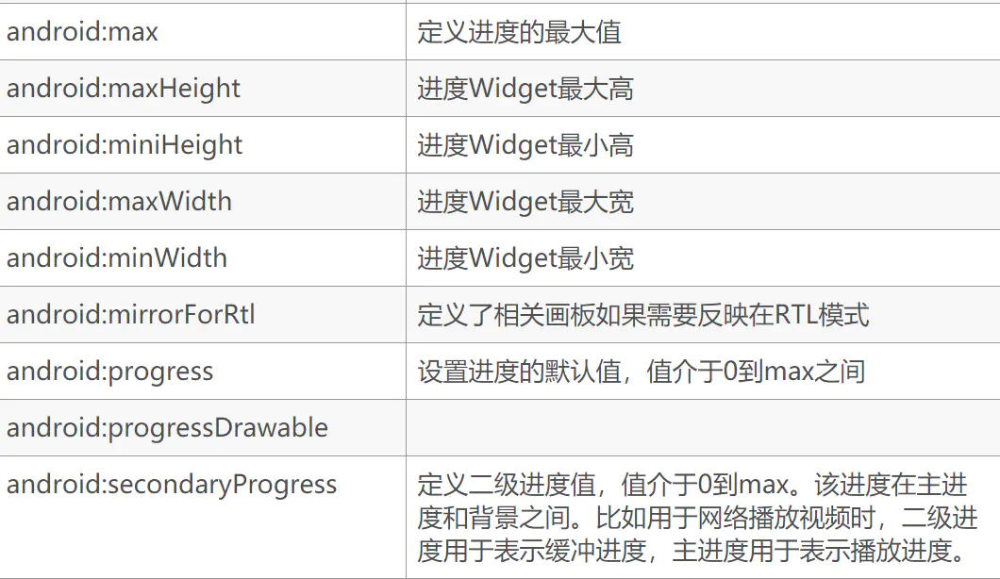

# 拖动条SeekBar

拖动条继承与进度条很多方法可以调用

## 属性方法





特别注意android:thumbTint="#00ff6f"可以设置拖动点的颜色


```
android:thumb="@drawable/ic_launcher_foreground"
```

换拖动点的图片


## 事件监听器

### 设置监听器

```java
sb_seekBar.setOnSeekBarChangeListener(this);
```

回调方法

onProgressChanged（）int i 为拖动条进度 boolean b为手动拖动时true

```java
@Override
    public void onProgressChanged(SeekBar seekBar, int i, boolean b) {
		//拖动点改变时调用
    }

    @Override
    public void onStartTrackingTouch(SeekBar seekBar) {
		//按下时调用
    }

    @Override
    public void onStopTrackingTouch(SeekBar seekBar) {
		//松开时调用
    }
```

```java
@Override
    public void onProgressChanged(SeekBar seekBar, int i, boolean b) {

        Toast.makeText(this,"拖动点改变",Toast.LENGTH_SHORT).show();
    }

    @Override
    public void onStartTrackingTouch(SeekBar seekBar) {
        Toast.makeText(this,"按下",Toast.LENGTH_SHORT).show();
    }

    @Override
    public void onStopTrackingTouch(SeekBar seekBar) {
        Toast.makeText(this,"松开",Toast.LENGTH_SHORT).show();
    }
```

## 实训案例


```html
<?xml version="1.0" encoding="utf-8"?>
<LinearLayout xmlns:android="http://schemas.android.com/apk/res/android"
    android:layout_width="match_parent"
    android:layout_height="match_parent"
    android:orientation="vertical">

    <SeekBar
        android:id="@+id/sb_seekBar"
        android:layout_width="match_parent"
        android:layout_height="wrap_content"
        android:layout_marginTop="30dp"
        android:progress="20"
        android:max="100"/>

    <TextView
        android:id="@+id/tv_textView"
        android:layout_width="match_parent"
        android:layout_height="wrap_content"
        android:gravity="center"
        android:textSize="22sp"
        android:text="数值范围0-100，当前值:20"/>

</LinearLayout>
```

```java
package com.test.newland.playerraw;

import android.os.Bundle;
import android.support.v7.app.AppCompatActivity;
import android.widget.SeekBar;
import android.widget.TextView;

public class SeekBarTest extends AppCompatActivity implements SeekBar.OnSeekBarChangeListener {

    private TextView tv_textView;
    private SeekBar sb_seekBar;

    @Override
    protected void onCreate(Bundle savedInstanceState) {
        super.onCreate(savedInstanceState);
        setContentView(R.layout.activity_seek_bar_test);

        tv_textView = findViewById(R.id.tv_textView);
        sb_seekBar = findViewById(R.id.sb_seekBar);
        sb_seekBar.setOnSeekBarChangeListener(this);
    }

    @Override
    public void onProgressChanged(SeekBar seekBar, int i, boolean b) {
        tv_textView.setText("数值范围0-100，当前值:"+i);
    }

    @Override
    public void onStartTrackingTouch(SeekBar seekBar) {

    }

    @Override
    public void onStopTrackingTouch(SeekBar seekBar) {

    }
}

```

