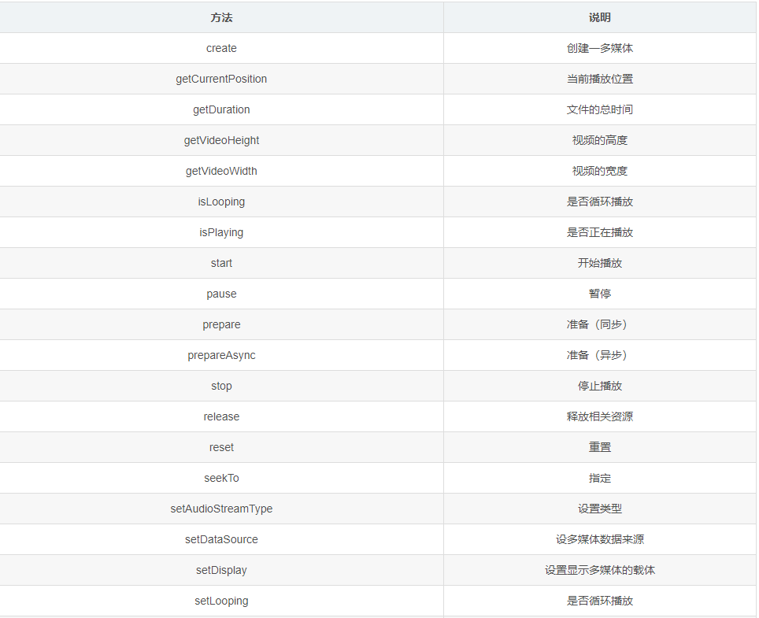

# MediaPlayer的使用

## 常用方法




```java
mediaPlayer = MediaPlayer.create(this,R.raw.tashanhe);//初始化
```

```java
getDuration();//获取播放最大长度
```

```java
getCurrentPosition();//获取实时播放进度
```

```java
getDuration();//获取播放最大长度
```

```java
isPlaying();//是否播放
```

```java
setLooping(true);//重复播放
```

```java
mediaPlayer.start();//播放
```

```java
mediaPlayer.seekTo(currPositon);//跳转到上次播放
```

```java
mediaPlayer.stop();//停止
```

```java
mediaPlayer.pause();//暂停
```


案例：

```java
package com.example.newland.playerraw;

import android.media.MediaPlayer;
import android.support.v7.app.AppCompatActivity;
import android.os.Bundle;
import android.util.Log;
import android.view.View;
import android.widget.ProgressBar;
import android.widget.SeekBar;

import java.util.Timer;
import java.util.TimerTask;

public class MainActivity extends AppCompatActivity implements View.OnClickListener, SeekBar.OnSeekBarChangeListener {

    private int currPositon = 0;//定义实时播放进度
    private int Duration = 0;//定义总时长变量
    private MediaPlayer mediaPlayer;
    private ProgressBar pb_music;
    private SeekBar sb_music;

    @Override
    protected void onCreate(Bundle savedInstanceState) {
        super.onCreate(savedInstanceState);
        setContentView(R.layout.activity_main);

        //设置监听器
        findViewById(R.id.btn_start).setOnClickListener(this);
        findViewById(R.id.btn_stop).setOnClickListener(this);
        findViewById(R.id.btn_pause).setOnClickListener(this);

        sb_music = findViewById(R.id.sb_music);

        pb_music = findViewById(R.id.pb_music);
        MediaPlayerInit();//初始化MediaPlayer

        //定时器线程
        TimerTask timerTask = new TimerTask() {
            @Override
            public void run() {
                //更新UI线程
                runOnUiThread(new Runnable() {
                    @Override
                    public void run() {

                        currPositon = mediaPlayer.getCurrentPosition();//获取实时播放进度
                        pb_music.setProgress(currPositon);//设置实时进度条
                        sb_music.setProgress(currPositon);//设置实时拖动条
                        Log.d("wang",String.valueOf(currPositon));
                    }
                });
            }
        };
        Timer timer = new Timer();//设置timer定时器用于重复执行线程
        timer.schedule(timerTask,0,100);//开启定时器线程  实时更新进度条拖动条

        sb_music.setOnSeekBarChangeListener(this);//对拖动条设置监听
    }

    private void MediaPlayerInit() {

        //先初始化一次mediaPlayer不然未播放时空指针
        mediaPlayer = MediaPlayer.create(this,R.raw.tashanhe);
        Duration = mediaPlayer.getDuration();//获取播放最大长度
        pb_music.setMax(Duration);//进度条设置最大进度
        sb_music.setMax(Duration);//拖动条设置最大进度
    }


    @Override
    public void onClick(View view) {

        switch (view.getId()){

            case R.id.btn_start:
                if(mediaPlayer.isPlaying() == false){//如果没有播放就播放 不判断会播放多个

                    mediaPlayer = MediaPlayer.create(this,R.raw.tashanhe);//用于启动
                    mediaPlayer.setLooping(true);//重复播放
                    mediaPlayer.start();//播放
                    if(currPositon != 0){//如果上次有播放暂停了继续播放
                        mediaPlayer.seekTo(currPositon);//跳转到上次播放
                    }
                }
                break;
            case R.id.btn_stop:
                    mediaPlayer.seekTo(0);//用于设置进度条和拖动条到0
                    mediaPlayer.stop();//停止 在暂停状态下也可执行

                break;
            case R.id.btn_pause:
                if(mediaPlayer.isPlaying() == true){//判断正在播放

                    mediaPlayer.pause();//暂停
                }
                break;
        }
    }

    @Override
    public void onProgressChanged(SeekBar seekBar, int i, boolean b) {

        //特别注意：直接跳转会一卡一卡

        //方式一:判断原本的进度是不是等于改变的进度 一样则为系统改变
//        if(i!=currPositon){
//            mediaPlayer.seekTo(i);
//
//        }
        //方式二:判断是不是手动改变进度条
        if(b){
            mediaPlayer.seekTo(i);
        }
        Log.d("wang","******");

    }

    @Override
    public void onStartTrackingTouch(SeekBar seekBar) {

    }

    @Override
    public void onStopTrackingTouch(SeekBar seekBar) {

    }

    @Override
    protected void onDestroy() {//释放
        super.onDestroy();
        if(mediaPlayer!=null){
            mediaPlayer.stop();
            mediaPlayer.release();
        }
    }
}
```

```html
<?xml version="1.0" encoding="utf-8"?>
<LinearLayout xmlns:android="http://schemas.android.com/apk/res/android"
    android:layout_width="match_parent"
    android:layout_height="match_parent"
    android:orientation="vertical">

    <Button
        android:id="@+id/btn_start"
        android:layout_width="match_parent"
        android:layout_height="wrap_content"
        android:text="播放"/>

    <Button
        android:id="@+id/btn_stop"
        android:layout_width="match_parent"
        android:layout_height="wrap_content"
        android:text="停止"/>

    <Button
        android:id="@+id/btn_pause"
        android:layout_width="match_parent"
        android:layout_height="wrap_content"
        android:text="暂停"/>

    <ProgressBar
        android:id="@+id/pb_music"
        android:layout_width="match_parent"
        android:layout_height="wrap_content"
        android:progress="0"
        style="@style/Widget.AppCompat.ProgressBar.Horizontal" />
    <SeekBar
        android:id="@+id/sb_music"
        android:layout_width="match_parent"
        android:layout_height="wrap_content"
        android:progress="0"
        style="@style/Widget.AppCompat.ProgressBar.Horizontal" />
</LinearLayout>
```

