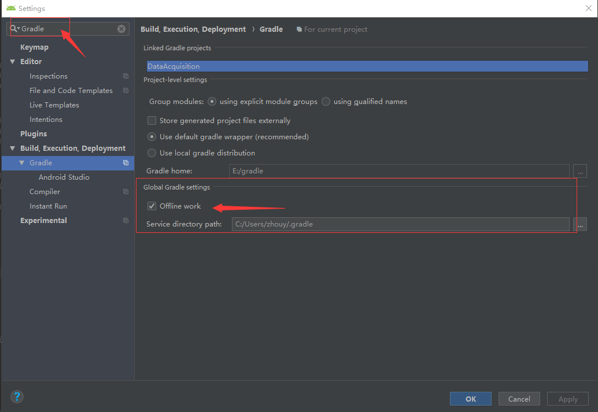
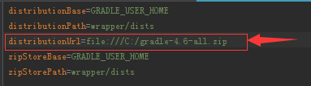
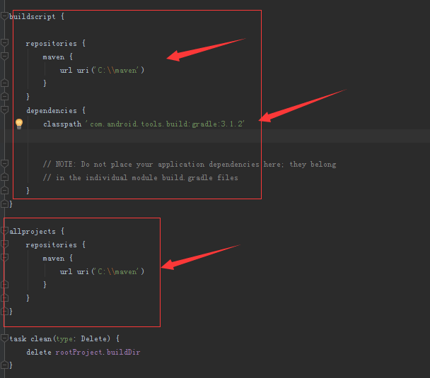
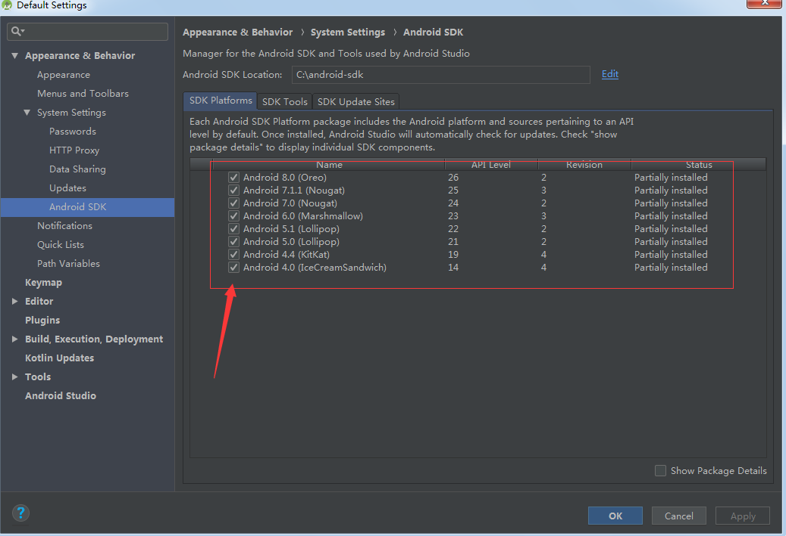
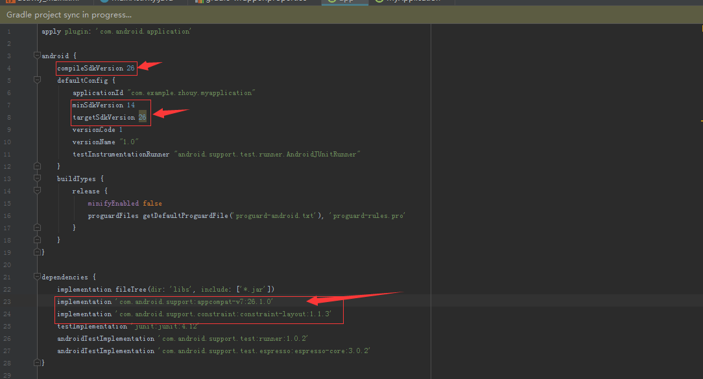

# 新大陆系统Android Studio离线开发环境搭建

##### 1.打开File->Settings打开如下界面，并输入Gradle，配置Build,Execution,Deployment->Gradle中的Offline work选项勾起。

##### 2.配置项目中gradle-wrapper.properties文件中的distributionUrl=为gradle压缩包的存储路径，如下图

##### 3.准备本地maven的访问路径，解压./maven.rar文件（可自行决定存放位置)

##### 4.配置工程目录下的build.gradle文件中的maven存储的路径，并设置gradle插件的版本根据项目需求决定

##### 5.此时可以打开AndroidStudio的SDK管理工具其中打钩的为支持的API版本和安卓机型

##### 6.配置App目录下的build.gradle文件中的compileSdkVersion，targerSdkVersion，minSdkVersion如下图：但必须是在SDK管理工具中支持的依赖库的版本修改如下。

##### 7.此时项目就可以正常编译运行了