# 新大陆安卓MQTT通信

## 一、搭建MQTT服务器


#### 1.在EMQX官网下载

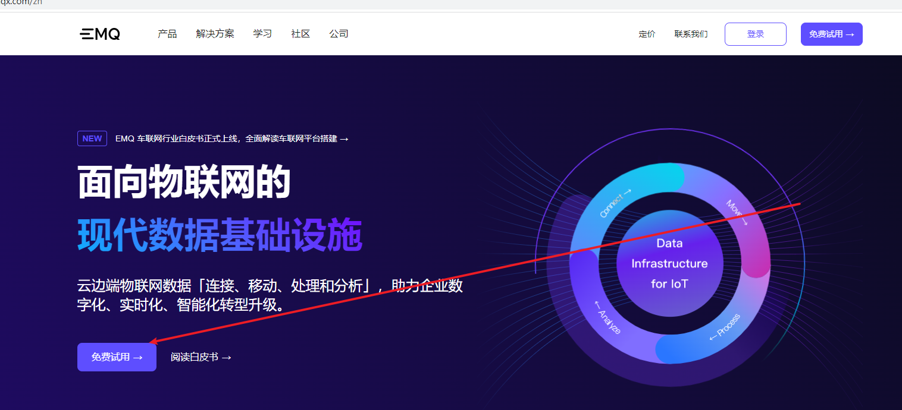

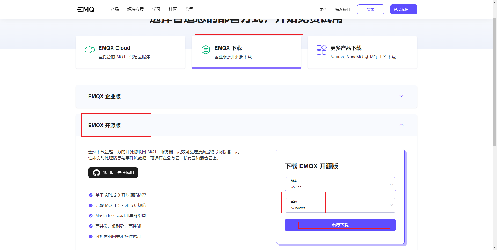

#### 2.下载解压后,找到bin目录

按下徽标加s搜索CDM,右键打开文件位置

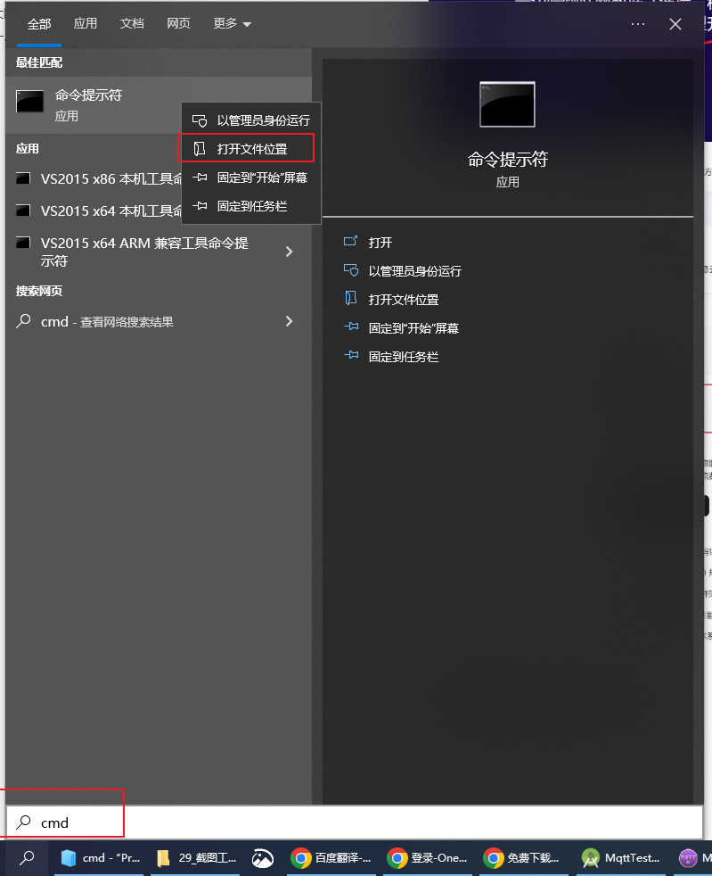

复制程序到bin目录

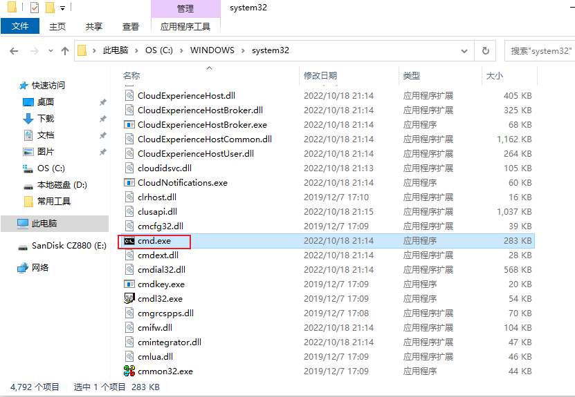

#### 3.在bin目录下运行

输入

```java
emqx console
```

后出现下图后

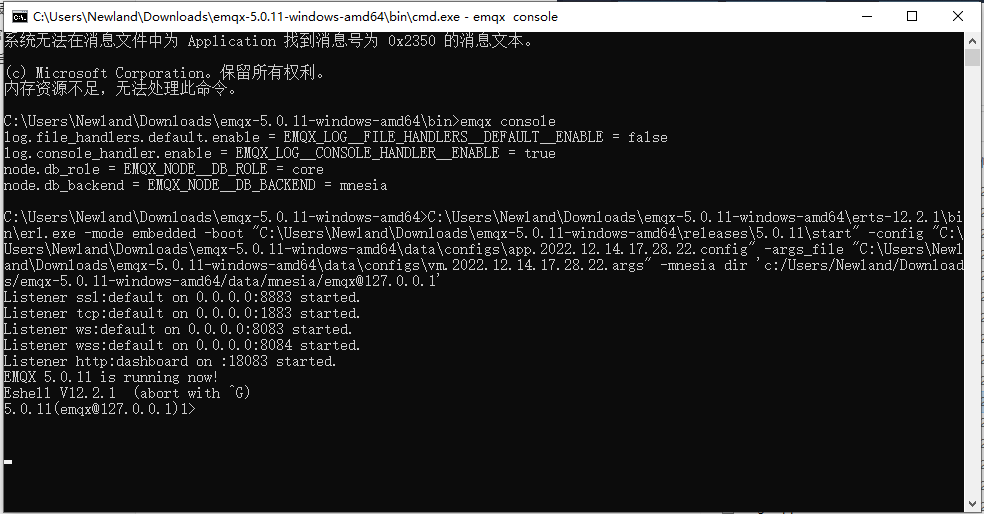

#### 4.在浏览器输入127.0.0.1端口1883

进入自己搭建的MQTT服务器


默认用户admin

默认密码public


#### 5.更改语言为中文

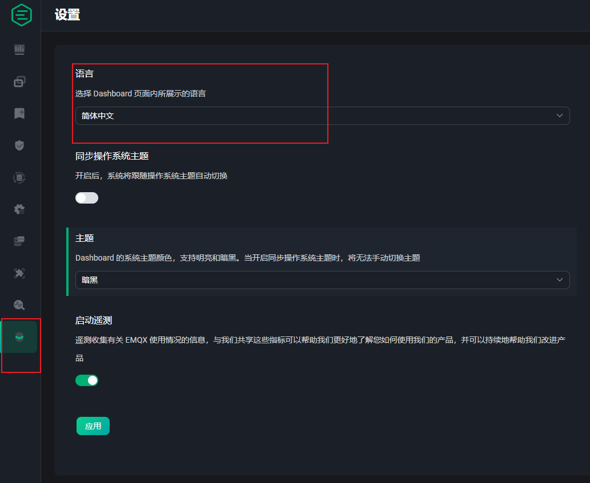


#### 6.说明


1. MQTT IP为本机IP
2. MQTT 用户名为注册时的用户名
3. MQTT 密码为注册时的密码

打开问题分析--->WebSocket 客户端

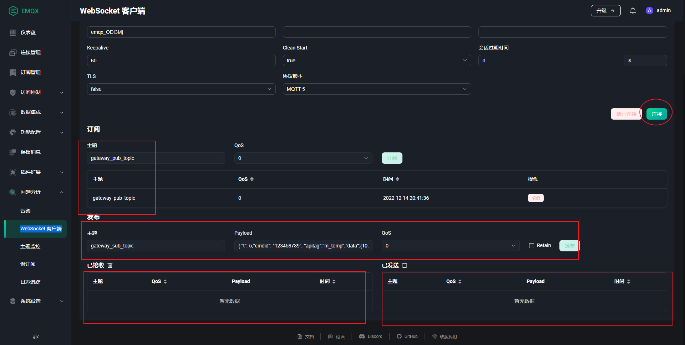

可以添加订阅主题和发布主题以及查看订阅内容和发布内容


## 二、打开MQTT.fx

#### 1.填写登陆参数

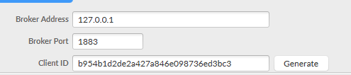

Broker Address 本机IP或者127.0.0.1

Broker Port1883

ClientID 随机生成

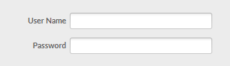

用户名和密码是注册登陆的

#### 2.测试订阅功能

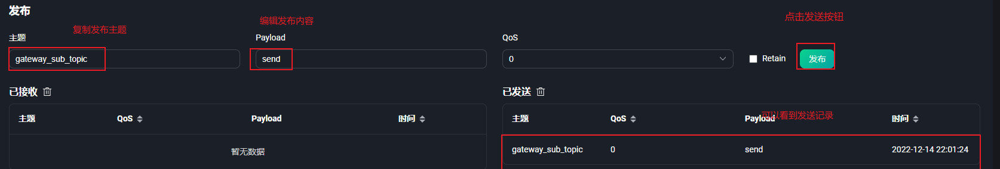

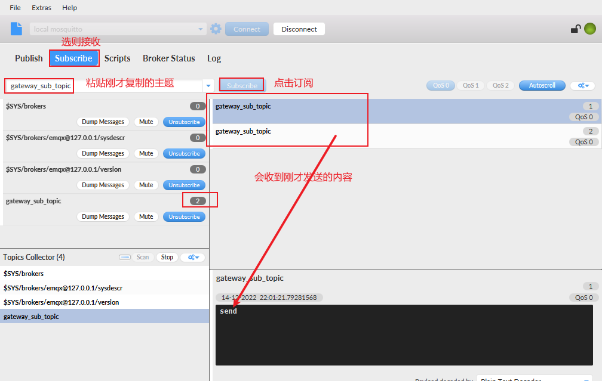

#### 3.测试发布功能


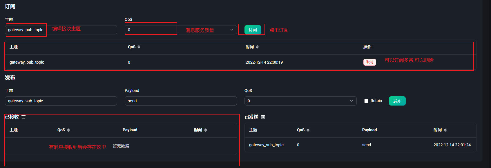


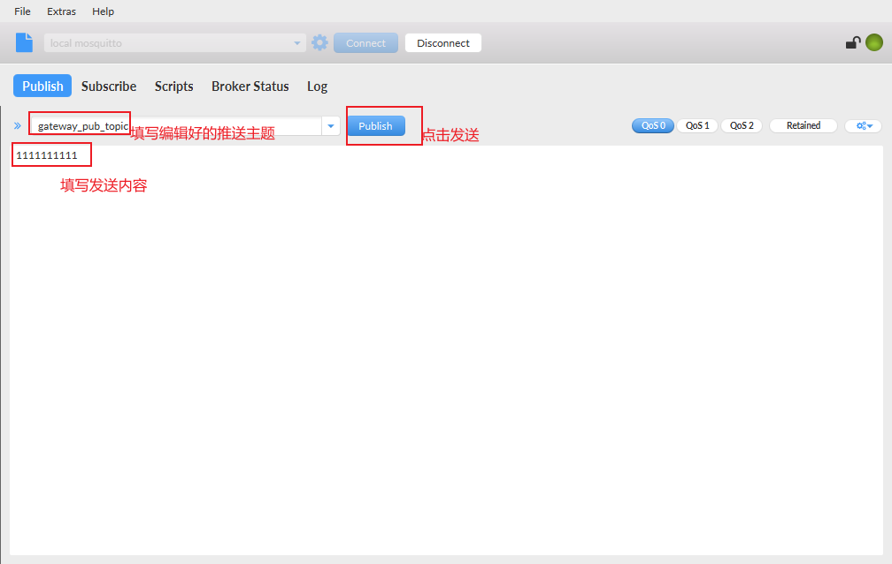

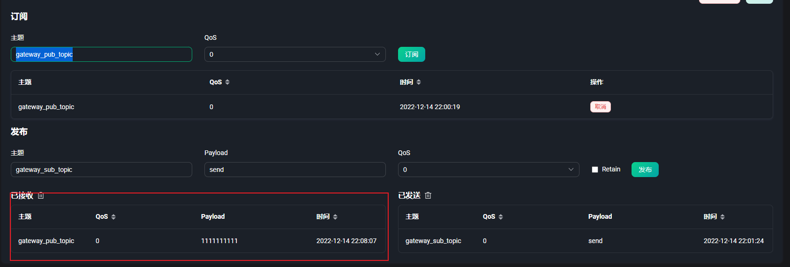


## 三、通过安卓实现MQTT