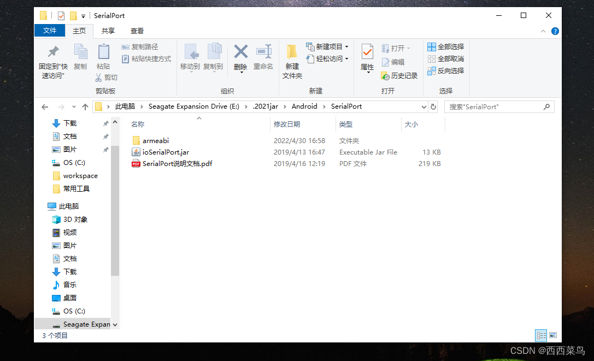
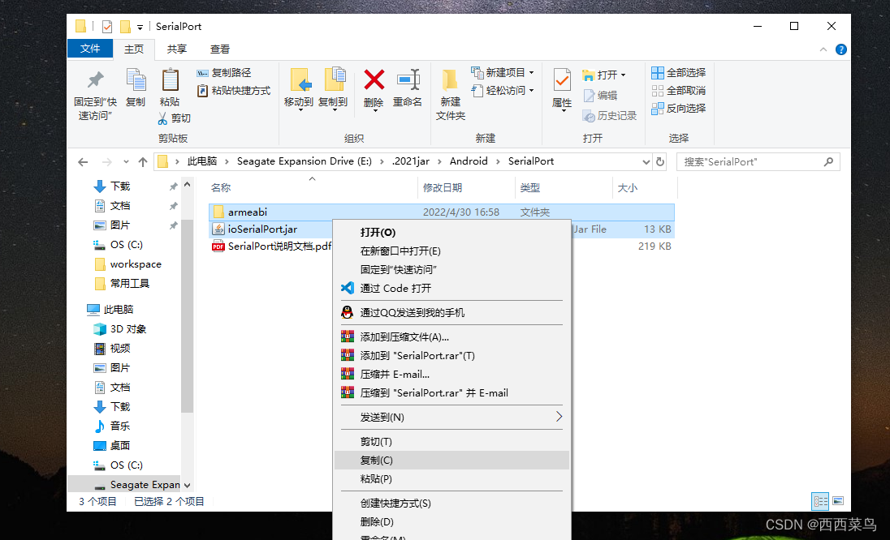
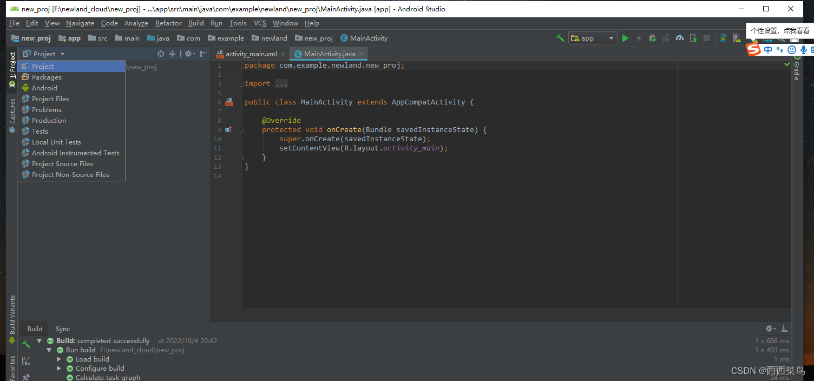
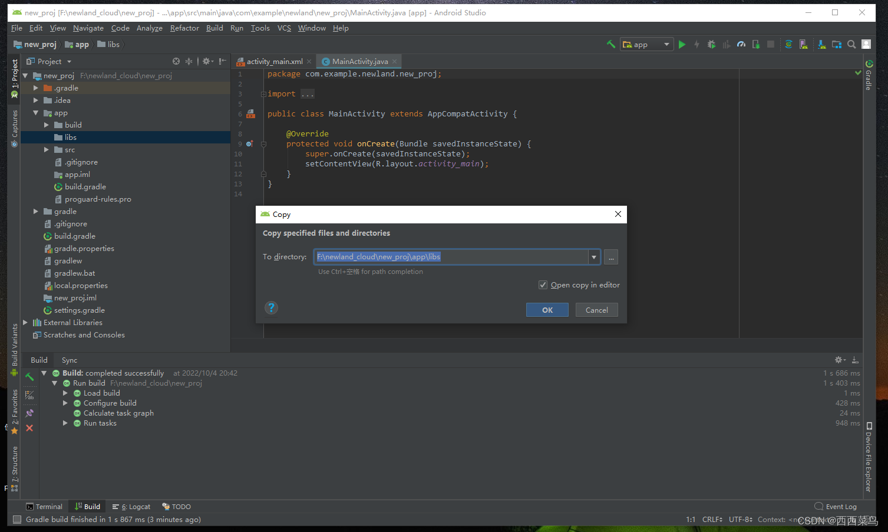
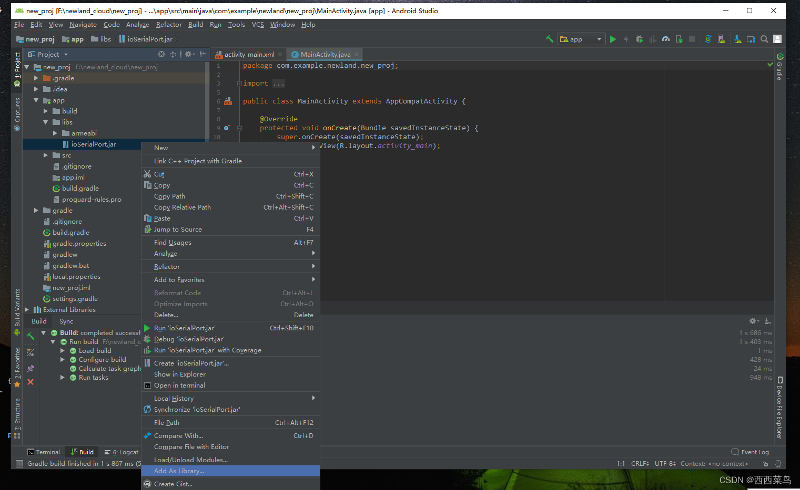
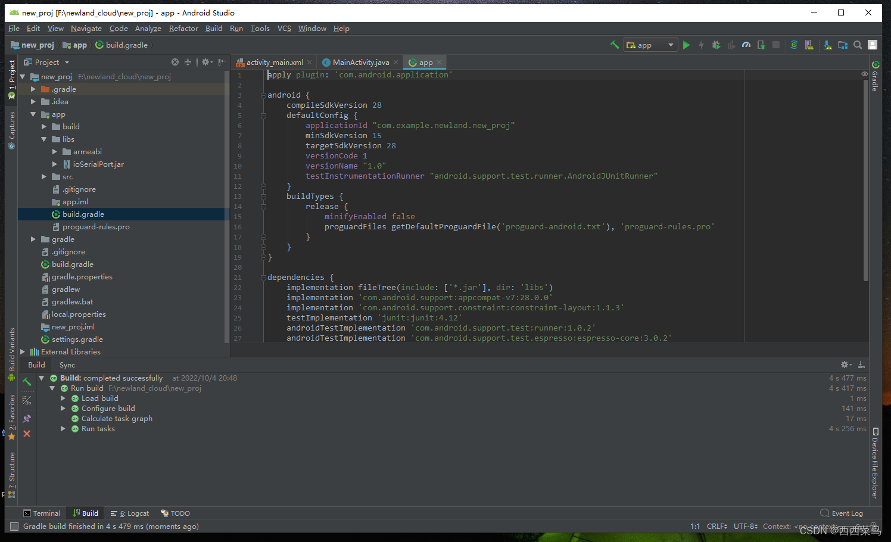
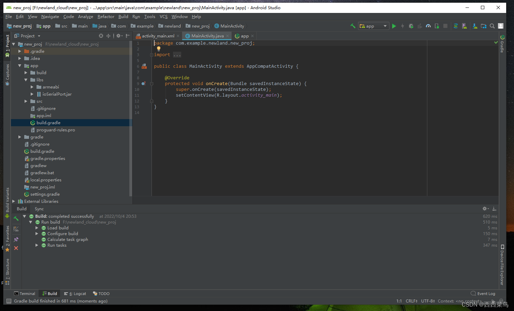

# 新大陆物联网竞赛-Android开发-导入JAR包与添加依赖


## 一、工具准备

- ​    Android studio 3.2
- ​    物联网竞赛JAR包

## 二、导入JAR

### 1.打开Android studio，并新建工程项目。


### 2.以我们所用到的SerialPort包为例，打开其存放的目录。 




### 3.选中armeabi文件夹与ioSerialPort.jar文件并复制。




### 4.将Android切换到Project视图。




### 5.按下图选中libs目录,并将所复制的jar包复制进入。




### 6.打开libs目录，选中jar文件，右键Add As Library，随后点击OK。




### 至此，JAR的导入已经完成。


## 三、依赖添加

​    由于架构不同，我们常需要在依赖中添加一些代码。

​    打开图中所示的build.gradle文件：



###     添加如下两端代码：

```java
ndk{
    abiFilters 'armeabi'
}
```

```java
sourceSets{
    main{
        jniLibs.srcDirs=['libs']
    }
}
```

###     随后执行Sync Now



​     可以看到编译通过，此时我们已经可以调用JAR包中的方法啦！