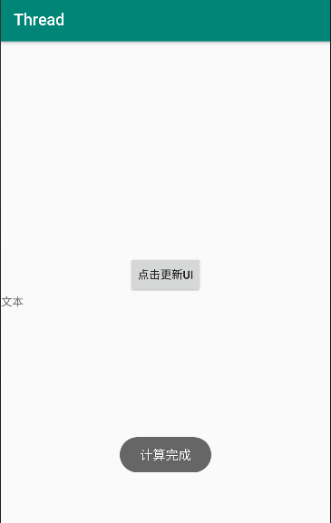
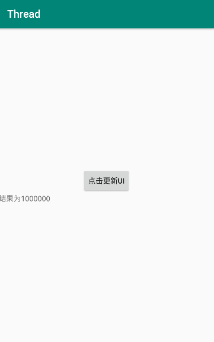

# 安卓线程与消息处理

## 一、线程启动的几种方式

### 1.启动线程的第一种方法：继承Thread类

```java
public class Thread01  {
    public static void main(String[] args) {
        //创建线程对象
        MyThread myThread = new MyThread();
        //启动线程
        myThread.start();

        //主线程
        for (int i = 0; i <100 ; i++) {
            System.out.println("main主线程--->" + i);
        }

    }
}
class MyThread extends Thread{
    @Override
    public void run() {
        for (int i = 0; i <100 ; i++) {
            System.out.println("分支线程---->"+ i);
        }
    }
}

```

### 2.启动线程的第二种方式：实现Runnable接口

```java
public class Thread02 {
    public static void main(String[] args) {
        //创建线程对象
        Thread thread = new Thread(new MyRunnable());
        //启动线程
        thread.start();

        //主线程
        for (int i = 0; i <100 ; i++) {
            System.out.println("main主线程--->" + i);
        }
    }
}
class MyRunnable implements Runnable{

    @Override
    public void run() {
        for (int i = 0; i <100 ; i++) {
            System.out.println("分支线程---->"+ i);
        }
    }
}

```

### 3.匿名内部类

```java
public class Thread03 {
    public static void main(String[] args) {
        Thread thread = new Thread(new Runnable() {
            @Override
            public void run() {
                for (int i = 0; i <1000 ; i++) {
                    System.out.println("分支线程-->" + i);
                }
            }
        });

        //启动线程
        thread.start();

        //主线程
        for (int i = 0; i <1000 ; i++) {
            System.out.println("main主线程--->"+ i);
        }
    }
}

```

### 4.实现Callable接口

```java
import java.util.concurrent.Callable;
import java.util.concurrent.ExecutionException;
import java.util.concurrent.FutureTask;

/***
 * 启动线程的第三种方法：实现Callable接口,重写call()方法
 */
public class ThreadTest04 {
    public static void main(String[] args) {
        //创建一个“未来任务类”对象
        FutureTask futureTask = new FutureTask(new Callable() {
            @Override
            public Object call() throws Exception { //call()方法相当与run()方法，比run方法好，有返回值
                System.out.println("call mothed begin!");
                Thread.sleep(1000 * 10);
                System.out.println("call mothed over!");

                int x = 100;
                int y = 200;

                return x + y;//自动装箱
            }
        });

        //创建线程对象
        Thread t = new Thread(futureTask);

        //启动线程
        t.start();

        Object obj = null;
        //获得分支线程返回值
        try {
            //get()方法的执行会导致主线程的阻塞
            obj = futureTask.get();
        } catch (InterruptedException e) {
            e.printStackTrace();
        } catch (ExecutionException e) {
            e.printStackTrace();
        }

        System.out.println("获得分支线程的返回值：" + obj );

        //如下的代码会等到分支线程执行结束后，才回到主线程中继续执行
        System.out.println("Hello CSDN");
    }
}


```

## 安卓能否在主线程实现耗时操作？


超过5秒系统无响应

## 安卓子线程能否更新UI？

不能更新UI调用

```java
runOnUiThread(new Runnable() {
                    @Override
                    public void run() {

                    }
                });
```

## 二、线程通信Handler机制

首先在主线程中创建Handler对象

同事重写handlerMassage方法在其判断接收子线程传过来的信息

在子线程中创建Message对象传入数据

调用handler.sendMessage方法传入Message对象


```java
Handler mhandler = new Handler(Looper.myLooper()){

    @Override
    public void handleMessage(Message msg) {

        super.handleMessage(msg);
        if(msg.what == 0){
            String s = (String) msg.obj;
            tv_textView.setText("结果为"+s);
        }
    }
};
```

```java
@Override
public void onClick(View view) {

    Toast.makeText(this,"计算完成",Toast.LENGTH_SHORT).show();

    new Thread(new Runnable() {
        @Override
        public void run() {
            Message message = new Message();
            String s = waitFor();
            message.what = 0;
            message.obj = s;
            mhandler.sendMessage(message);


        }
    }).start();
}
```






完整代码

```java
package com.example.newland.thread;

import android.content.Context;
import android.os.Handler;
import android.os.Looper;
import android.os.Message;
import android.os.health.TimerStat;
import android.support.v7.app.AppCompatActivity;
import android.os.Bundle;
import android.util.Log;
import android.view.View;
import android.widget.TextView;
import android.widget.Toast;

import java.util.Timer;
import java.util.TimerTask;

public class MainActivity extends AppCompatActivity implements View.OnClickListener {

    private TextView tv_textView;

    Handler mhandler = new Handler(Looper.myLooper()){

        @Override
        public void handleMessage(Message msg) {

            super.handleMessage(msg);
            if(msg.what == 0){
                String s = (String) msg.obj;
                tv_textView.setText("结果为"+s);
            }
        }
    };

    @Override
    protected void onCreate(Bundle savedInstanceState) {
        super.onCreate(savedInstanceState);
        setContentView(R.layout.activity_main);

        findViewById(R.id.btn_time).setOnClickListener(this);
        tv_textView = findViewById(R.id.tv_textView);
    }

    private String waitFor(){

        String s = "1";
        for (int i = 0; i <6 ; i++) {

            try {
                Thread.sleep(1000);
            } catch (InterruptedException e) {
                e.printStackTrace();
            }
            s=s+"0";
        }
        return s;
    }

    @Override
    public void onClick(View view) {

        Toast.makeText(this,"计算完成",Toast.LENGTH_SHORT).show();

        new Thread(new Runnable() {
            @Override
            public void run() {
                Message message = new Message();
                String s = waitFor();
                message.what = 0;
                message.obj = s;
                mhandler.sendMessage(message);


            }
        }).start();
    }
}
```

## 三、Timer和TimerTask

这两个类是配对使用的Timer类用于定时TimerTask类用于受Timer类的约束来执行操作的线程

创建TimerTask类的对象传入实现Runnable接口的类重写Run方法里面是重复执行的任务

创建Timer对象

调用schedule()方法传入参数TimerTask对象，延时时间执行的一次，每次执行间隔时间、

类似于单片机定时器

```java
package com.example.newland.thread;

import android.support.v7.app.AppCompatActivity;
import android.os.Bundle;
import android.view.View;
import android.widget.TextView;

import java.util.Timer;
import java.util.TimerTask;

public class Main2Activity extends AppCompatActivity implements View.OnClickListener {

    private int time = 10;
    private TextView tv_time;

    @Override
    protected void onCreate(Bundle savedInstanceState) {
        super.onCreate(savedInstanceState);
        setContentView(R.layout.activity_main2);

        findViewById(R.id.btn_start).setOnClickListener(this);
        tv_time = findViewById(R.id.tv_time);
    }

    @Override
    public void onClick(View view) {


        timer.schedule(timerTask,0,1000);
    }

    Timer timer = new Timer();
    TimerTask timerTask = new TimerTask() {
        @Override
        public void run() {

                runOnUiThread(new Runnable() {
                    @Override
                    public void run() {

                        tv_time.setText(String.valueOf(time));
                        time--;
                        if(time<0){
                        timer.cancel();
                    }
                }
                });
            }
    };
}
```

```html
<?xml version="1.0" encoding="utf-8"?>
<LinearLayout xmlns:android="http://schemas.android.com/apk/res/android"
    android:layout_width="match_parent"
    android:layout_height="match_parent"
    android:orientation="vertical">

    <Button
        android:id="@+id/btn_start"
        android:layout_width="match_parent"
        android:layout_height="wrap_content"
        android:text="开始倒计时"/>

    <TextView
        android:id="@+id/tv_time"
        android:layout_width="match_parent"
        android:layout_height="wrap_content"
        android:textSize="22sp"/>
</LinearLayout>
```


Handler中的post方法和postDelay方法也可以实现多线程和定时执行的功能

但是这个是执行的主线程，所以在里面可以更新UI

例子

```java
package com.example.newland.myprort;

import android.os.Handler;
import android.support.v7.app.AppCompatActivity;
import android.os.Bundle;
import android.view.View;
import android.widget.ImageView;
import android.widget.TextView;

import com.nle.mylibrary.forUse.mdbus4150.MdBus4150RelayListener;
import com.nle.mylibrary.forUse.mdbus4150.MdBus4150SensorListener;
import com.nle.mylibrary.forUse.mdbus4150.Modbus4150;
import com.nle.mylibrary.forUse.rfid.RFID;
import com.nle.mylibrary.forUse.rfid.SingleEpcListener;
import com.nle.mylibrary.forUse.zigbee.ZigBee;
import com.nle.mylibrary.transfer.ConnectResultListener;
import com.nle.mylibrary.transfer.DataBus;
import com.nle.mylibrary.transfer.DataBusFactory;

public class MainActivity extends AppCompatActivity implements View.OnClickListener {
    ImageView ivfan,ivlight;
    TextView yangan,tem,hum,rfid;

    Modbus4150 modbus4150;
    ZigBee zigBee;
    RFID rfid1;

    double[] temhum;

    @Override
    protected void onCreate(Bundle savedInstanceState) {
        super.onCreate(savedInstanceState);
        setContentView(R.layout.activity_main);


        mhandler.post(runnable);
        init();
    }

    private void init() {
        ivfan = findViewById(R.id.iv_fan);
        ivlight = findViewById(R.id.iv_light);
        yangan = findViewById(R.id.tv_yanwu);
        tem = findViewById(R.id.tv_tem);
        hum = findViewById(R.id.tv_hum);
        rfid = findViewById(R.id.tv_rfid);

        ivfan.setOnClickListener(this);
        ivlight.setOnClickListener(this);
        modbus4150 = new Modbus4150(DataBusFactory.newSocketDataBus("172.20.13.15", 6003), new ConnectResultListener() {
            @Override
            public void onConnectResult(boolean b) {

            }
        });


        zigBee = new ZigBee(DataBusFactory.newSocketDataBus("172.20.13.15", 6004), new ConnectResultListener() {
            @Override
            public void onConnectResult(boolean b) {

            }
        });


        rfid1 = new RFID(DataBusFactory.newSocketDataBus("172.20.13.15", 6001), new ConnectResultListener() {
            @Override
            public void onConnectResult(boolean b) {

            }
        });
    }
    Handler mhandler = new Handler();

    Runnable runnable =new Runnable() {
        @Override
        public void run() {

            mhandler.postDelayed(runnable,5000);

            try {
                modbus4150.getDIVal(1, new MdBus4150SensorListener() {
                    @Override
                    public void onVal(int i) {
                        if (i==1){
                            yangan.setText("有烟");
                        }
                        else if(i==0){
                            yangan.setText("无烟");
                        }
                    }
                    @Override
                    public void onFail(Exception e) {

                    }
                });
            } catch (Exception e) {
                e.printStackTrace();
            }

            try {

                temhum = zigBee.getTmpHum();
                tem.setText("温度："+temhum[0]);
                hum.setText("湿度："+temhum[1]);


            } catch (Exception e) {
                e.printStackTrace();
            }

            try {
                rfid1.readSingleEpc(new SingleEpcListener() {
                    @Override
                    public void onVal(String s) {
                        rfid.setText(s+"");
                    }

                    @Override
                    public void onFail(Exception e) {
                    }
                });
            } catch (Exception e) {
                e.printStackTrace();
            }


        }
    };

    @Override
    public void onClick(View view) {
        switch (view.getId()){
            case R.id.iv_fan:
                try {
                    modbus4150.ctrlRelay(0, false, new MdBus4150RelayListener() {
                        @Override
                        public void onCtrl(boolean b) {

                        }

                        @Override
                        public void onFail(Exception e) {

                        }
                    });
                } catch (Exception e) {
                    e.printStackTrace();
                }
                break;
            case R.id.iv_light:

                break;
        }
    }
}

```

postDelay()可以延时重复执行run中的任务

放在run中调用时 可以传参this


```java
package com.example.newland.b_t6;

import android.os.Handler;
import android.support.v7.app.AppCompatActivity;
import android.os.Bundle;
import android.util.Log;

public class MainActivity extends AppCompatActivity {

    @Override
    protected void onCreate(Bundle savedInstanceState) {
        super.onCreate(savedInstanceState);
        setContentView(R.layout.activity_main);
        long id = Thread.currentThread().getId();
        Log.d("wang",String.valueOf(id));


        mhandler.post(new Runnable() {
            @Override
            public void run() {

                mhandler.postDelayed(this,5000);
                long id = Thread.currentThread().getId();
                Log.d("wang",String.valueOf(id));
            }
        });

        new Thread(new Runnable() {
            @Override
            public void run() {
                long id = Thread.currentThread().getId();
                Log.d("wang",String.valueOf(id));
            }
        }).start();

    }

    Handler mhandler = new Handler();

}
```

Thread.currentThread().getId();

输出线程ID

2022-09-09 07:30:26.849 4029-4029/? D/wang: 2
2022-09-09 07:30:26.850 4029-4049/? D/wang: 213
2022-09-09 07:30:26.863 4029-4029/? D/wang: 2


具体参照

https://blog.csdn.net/DG_summer/article/details/52145378?spm=1001.2101.3001.6650.6&utm_medium=distribute.pc_relevant.none-task-blog-2%7Edefault%7EOPENSEARCH%7ERate-6-52145378-blog-51142029.pc_relevant_aa_2&depth_1-utm_source=distribute.pc_relevant.none-task-blog-2%7Edefault%7EOPENSEARCH%7ERate-6-52145378-blog-51142029.pc_relevant_aa_2&utm_relevant_index=12