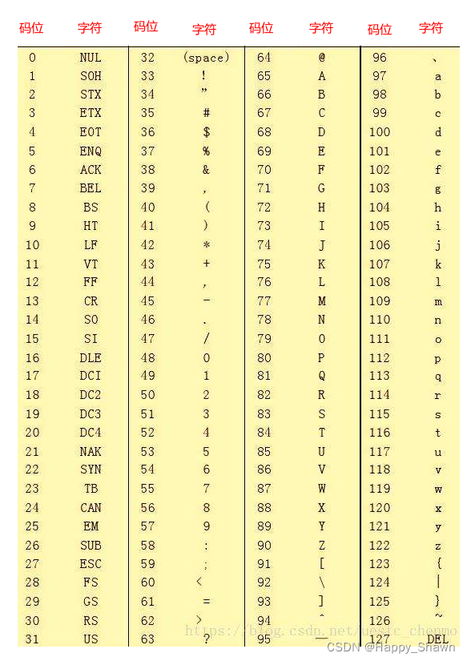
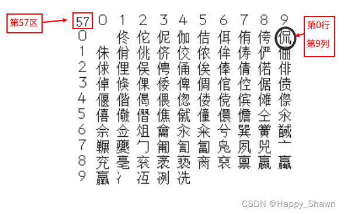

# 编码之ASCII，UTF-8（Unicode），GBK，GB2312

## 编码

计算机中的编码，通俗的讲就是字符怎样在计算机中的表示和存储。要弄明白编码，就要清楚这里的表示和存储这两个概念：

表示，也就是说的各种字符集（ASCII字符集，GBK字符集等），一般由码位和字符组成，其实就是字符和码位的映射。

存储，也就是如何将字符集中的字符存储在计算机中里面

直接举例来说：

## ASCII编码

ASCII编码由美国人发明，它采用ASCII字符集，包含了以下128个字符：

可见字符（共95个）：包含小写的英文字母，数字，标点符号。

不可见字符（也称为控制字符，共33个）：包含空格，换行，标题开始，正文开始，回车等

ASCII字符集如下图所示




有了字符集（表示），我们就可以来说一下存储了：ASCII编码的存储规则很简单，就是直接将每个字符对应的码位转换成二进制信息进行存储，由于128个码值（0-127）用7位就可以表示（2^7=128），但计算机的存储单位1个字节由8位组成，所以就直接用8位表示了，即从0000 0000 到 0111 1111，共128个，这样的二进制信息就叫作ASCII码。

## 扩展ASCII编码


后来，计算机传到了欧洲，欧洲的国家发现ASCII字符集里面并没有包含他们欧洲国家使用的一些字符，而且，8位的ASCII字符集实际上只用了7位，索性就在原有的ASCII码上进行扩展（增加了1000 0000 到 1111 1111，128个字符），这新增的128个字符就叫作扩展ASCII字符集，当然存储规则并没有变。

## GB2312编码

再后来，计算机来到了中国，我们发现这1个字节表示的256字符根本没有中文啊，1个字节就能表示256个字符，这怎么够用。索性我们自己设计一个编码吧，我们就叫它GB2312（国标2312）。首先，先设计字符集，我们使用了分区管理的方法，将字符集分为94个区（有些区是空的），每个区含有94个码位（字符），共计8836个字符。如下是57区：




码位怎么表示呢？我们可以看到，侃字位于第57区，第0行，第9列，所以侃字的码位就是5709。这样我们就有了每个字符和其对应的码位（字符集），接下来就可以谈存储了！它的存储规则如下，以侃字为例，将其码位5709，先分为57和09两部分，然后分别用其十六进制加上0xA0，然后再合并：57的十六进制是0x39，和0xA0相加是0xD9，09的十六进制是0x09，和0xA0相加是0xA9。所以侃这个字最终的GB2312码为0xD90xA9（D9A9）。至于问什么要这么存储，有兴趣的可以自行百度一下。

## GBK编码

后来随着汉字增加，原有的GB2312字符集也不够用了，所以又对其进行了扩充，将之前94个区保留的空的区也用上，存储规则也发生了一些改变（具体不再赘述），就形成了GBK编码。（其实后来又对GBK进行了扩充，就出现了GB18030编码）

## Unicode标准

再后来由于各个国家都设计自己的字符集，太乱了。。。ISO就看不下去，是时候管管了，干脆来一个大集合，把世界上所有的字符都包含进去，然后编上号。所以，Unicode（万国码）就诞生了，这里Unicode其实是个标准，它包含了字符集以及对应的编码规则。最开始Unicode使用UCS-2字符集（16位，能表示65536个字符），将码位对应的二进制直接存储。但65536个字符还是无法cover住世界上所有的字符。后来出现了USC-4字符集（32位，能表示近43亿个字符，连emoji都放进去了），然后将码位对应的二进制直接存储，这下总算是能放下了。但是！！！英文人家只要8位就够了，我们中文只要16位就够了，你这直接整了32位，也太浪费了吧。所以就出现了接下来UTF-8这个编码规则！！！


## UTF-8编码

它是一种可变长编码格式，每次传输8位数据。可以将其理解为Unicode标准的一种实现：

UTF-8将USC-4字符集的码位，划分为4个区间：

```java
码位                   |        UTF-8编码方式（存储方式）
(十六进制)              |              （二进制）
--------------------------------------------------------------------
0000 0000 - 0000 007F | 0xxxxxxx(0开头，表明该字符由1个字节)
0000 0080 - 0000 07FF | 110xxxxx 10xxxxxx(2个1开头，表明该字符由2字节表示)
0000 0800 - 0000 FFFF | 1110xxxx 10xxxxxx 10xxxxxx(3个1开头，表明该字符由3字节表示)
0001 0000 - 0010 FFFF | 11110xxx 10xxxxxx 10xxxxxx 10xxxxxx(4个1开头，表明该字符由4字节表示)

```

使用方法举例（存储规则）：

如王这个字，它在USC-4字符集里面的码位是 0000 738B，它属于第三区间，将其转化为二级制为 0000 0000 0000 0000 0111 0011 1000 1011，由于属于第三区间，则将其二进制表示的码值，按从右往左的顺序插入到 1110xxxx 10xxxxxx 10xxxxxx 中，最后的结果就是 11100111 10001110 10001011，这就是王字的UTF-8码值，转换为16进制的表示形式为 0xe7 0x8e 0x8h（e78e8h）。

## 番外篇：“锟斤拷”、“烫烫烫”、“屯屯屯”

### “锟斤拷”

一般在UTF-8和中文编码（如GBK）的转换过程中产生。Unicode所使用的字符集中有一个特殊的替换符号，你一定见过，如下所示，专门用于表示无法识别或者无法展示的字符：


### “烫烫烫”和“屯屯屯”

这种乱码最常见的地方是Visual Studio里。Visual Studio中，未初始化的栈空间用0xCC填充，而未初始化的堆空间用0xCD填充。而0xCCCC和0xCDCD在中文GB2312编码中分别对应“烫”字和“屯”字。如果一个字符串没有结束符’\0’，输出时就会打印出未初始化的栈或堆空间的内容，这就是大名鼎鼎的“烫烫烫”、“屯屯屯”乱码。


## 所占字节数

- 1，ASCII码：一个英文字母（不分大小写）占一个字节的空间，一个中文汉字占两个字度节的空间。
- 2，UTF-8编码：一个英文字符等于一个字节，一个中文（含繁体）等于三个字节。中文标点占三个字节，英文标点占一个字节
- 3，Unicode编码：一个英文等于两个字节，一个中文（含繁体）等于两个字节。中文标点占两个字节，英文标点占两个字节

- 4，GBK编码：中文2个字节，英文1个字节；