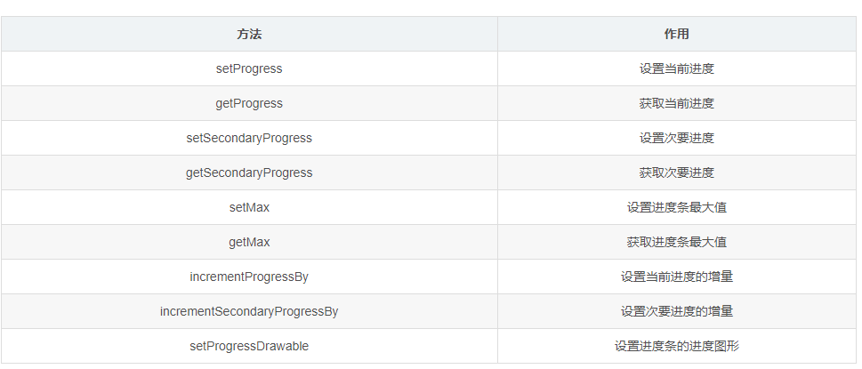

# 进度条的使用ProgressBar

## 一、ProgressBar基本属性及其应用

### 1.圆形

```html
<ProgressBar
        style="@style/Widget.AppCompat.ProgressBar"
        android:layout_width="wrap_content"
        android:layout_height="wrap_content" />
```

不可以定义长度和进度

主题为style="@style/Widget.AppCompat.ProgressBar"

### 2.长条

```html
<ProgressBar
        style="@style/Widget.AppCompat.ProgressBar.Horizontal"
        android:layout_width="match_parent"
        android:layout_height="wrap_content"
        android:max="100"
        android:progress="30"/>
```

可以定义长度和进度

主题为style="@style/Widget.AppCompat.ProgressBar.Horizontal"

max属性为进度条最大值

progress为进度条进度




```html
<?xml version="1.0" encoding="utf-8"?>
<LinearLayout xmlns:android="http://schemas.android.com/apk/res/android"
    android:layout_width="match_parent"
    android:layout_height="match_parent"
    android:orientation="vertical">

    <Button
        android:id="@+id/btn_start"
        android:layout_width="match_parent"
        android:layout_height="wrap_content"
        android:text="播放"/>

    <Button
        android:id="@+id/btn_pause"
        android:layout_width="match_parent"
        android:layout_height="wrap_content"
        android:text="暂停"/>

    <Button
        android:id="@+id/btn_stop"
        android:layout_width="match_parent"
        android:layout_height="wrap_content"
        android:text="停止"/>

    <ProgressBar
        style="@style/Widget.AppCompat.ProgressBar"
        android:layout_width="wrap_content"
        android:layout_height="wrap_content"/>
    <ProgressBar
        android:id="@+id/pb_click"
        style="@style/Widget.AppCompat.ProgressBar.Horizontal"
        android:layout_width="match_parent"
        android:layout_height="wrap_content"
        android:max="100"
        android:progress="3" />
    <Button
        android:id="@+id/btn_click"
        android:layout_width="match_parent"
        android:layout_height="wrap_content"
        android:text="点我"/>

</LinearLayout>
```

```java
package com.test.newland.playerraw;

import android.media.MediaPlayer;
import android.support.v7.app.AppCompatActivity;
import android.os.Bundle;
import android.view.View;
import android.widget.ProgressBar;

public class MainActivity extends AppCompatActivity implements View.OnClickListener {

    private MediaPlayer mediaPlayer;
    private int currPosition;
    private ProgressBar pb_click;

    @Override
    protected void onCreate(Bundle savedInstanceState) {
        super.onCreate(savedInstanceState);
        setContentView(R.layout.activity_main);

        findViewById(R.id.btn_start).setOnClickListener(this);
        findViewById(R.id.btn_stop).setOnClickListener(this);
        findViewById(R.id.btn_pause).setOnClickListener(this);
        findViewById(R.id.btn_click).setOnClickListener(this);
        pb_click = findViewById(R.id.pb_click);

    }

    @Override
    public void onClick(View view) {

        switch (view.getId()){
            case R.id.btn_start:
                mediaPlayer = MediaPlayer.create(this, R.raw.test);
                mediaPlayer.start();
                if(currPosition!=0){
                    mediaPlayer.seekTo(currPosition);
                }
                break;
            case R.id.btn_stop:
                mediaPlayer.stop();
                break;
            case R.id.btn_pause:
                currPosition = mediaPlayer.getCurrentPosition();
                mediaPlayer.pause();
                break;
            case R.id.btn_click:
                pb_click.setProgress(pb_click.getProgress()+3);
                break;
        }
    }
}

```

